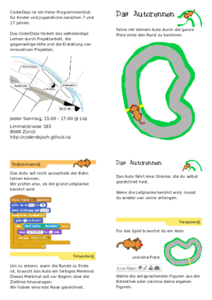
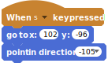

# Car Race

warning: the screenshot are probably lost. redo it taking into consideration also http://scratched.gse.harvard.edu/sites/default/files/autorennen.pdf ?

## Printing on A4


  

Download this PDF and print it both sides witout any resizing on A4 paper:  

- [A4 pdf Deutsch](https://github.com/CoderDojoZH/resources/raw/master/cards-games/car-race/car-race-a4-deCH.pdf)
- [A4 pdf English](https://github.com/CoderDojoZH/resources/raw/master/cards-games/car-race/car-race-a4-en.pdf)

## Preparing the PDF and PNG files

### Producing the A4 PDF and its PNG preview

- producing the PDF from Scribus with the following custom range:  
  `8,1,6,3,2,7,4,5`
- use `pdfnup` (from the pdfjam package) to put 4 A6 pages on each A4 side:  
  `pdfnup --nup 2x2 --frame false --no-landscape car-race-a6-reordered-deCH.pdf --outfile car-race-a4-deCH.pdf`
  `pdfnup --nup 2x2 --frame false --no-landscape car-race-a6-en.pdf --outfile car-race-a4-en.pdf`
- for the PNG preview of the A4 version:  
  `convert -background white -alpha remove -resize 300x car-race-a4-deCH.pdf car-race-a4.png`  
  to get `car-race-a4-1.png` to `car-race-a4-3.png`




```
When [s v] key pressed
go to x: (102) y: (-96)
point in direction  (-105 v)
```


```
forever
    move (1) steps
```


```
When [left arrow v] key pressed
turn ccw (15 v) degrees
```


```
When [right arrow v] key pressed
turn cw (15 v) degrees
```


```
When [s v] key pressed
go to x: (102) y: (-96)
point in direction  (-105 v)
forever
    move (1) steps
    if <touching color [#00ff00]> then
        say [Game Over!!] for (2) secs
        stop [this script v]
    end
end
```


```
if <color [#ff0000] is touching [#ff000]> then
    play sound [meow v]
    say [Game Over!!] for (2) secs
    stop [this script v]
end
```
