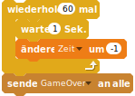
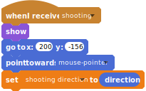

# Car Race

## Printing on A4


  

Download this PDF and print it both sides witout any resizing on A4 paper:  

- [A4 pdf Deutsch](https://github.com/CoderDojoZH/resources/raw/master/cards-games/dose/dose-a4-deCH.pdf)
- [A4 pdf English](https://github.com/CoderDojoZH/resources/raw/master/cards-games/dose/dose-a4-en.pdf)

## Scratch scripts

### stage init


```
When Flag clicked
set [time v] to [60]
show variable [time v]
set [points v] to [0]
set [falling speed v] to [-0.2]
set [velocity v] to [10]
```


```
Wenn die grüne Flagge angeklickt
setze [Zeit v] auf [60]
zeige Variable [Zeit v]
setze [Punkte v] auf [0]
setze [runterfallen v] auf [-0.2]
setze [Geschwindigkeit v] auf [10]
```

### stage loop


```
repeat (60)
    wait (1) secs
    change [time v] by (-1)
broadcast [GameOver v]
```



```
wiederhole (60) mal 
  warte (1) Sek.
  ändere [Zeit v] um (-1)
end
sende [GameOver v] an alle
```

### target move


```
When flag clicked
show
forever
    go to [mouse-pointer v]
```


```
Wenn die grüne Flagge angeklickt
zeige dich
wiederhole fortlaufend 
  gehe zu [Mauszeiger v]
end
```

### target actions


```
When this sprite clicked
broadcast [shooting v]
```


```
When I receive [Game Over v]
hide
stop [other scripts in sprite v]
```


```
Wenn ich angeklickt werde
sende [schiessen v] an alle
```


```
Wenn ich [Game Over v] empfange
verstecke dich
stoppe [andere Skripte der Figur v]
```

### wizard-init


```
When flag clicked
set size to (50)%
go to x: ([x position v] of [ Wizard v]) y: ([y position v] of [Wizard v])
go to front
show
```


```
Wenn die grüne Flagge angeklickt
setze Größe auf (50) %
gehe zu x: ([x position v] von [Zauberer v]) y: ([y position v] von [Zauberer v])
komme nach vorn
zeige dich
```

### lightning-init



```
when I receive [shooting v]
show
go to x: (200) y: (-156)
point towards [mouse-pointer v]
set [shooting direction v] to (direction)
```


```
Wenn ich [abschiessen v] empfange
zeige dich
gehe zu x: ([x position v] von [Zauberer v]) y: ([y position v] von [Zauberer v])
drehe dich zu [Mauszeiger v]
setze [Schussrichtung v] auf (Richtung)
```

### lightning-move-around


```
repeat until <touching [edge v]
    if <touching[can v]> then
        broadcast [hit v]
        hide
        go to x: (-200) y: (-156)
        point in direction (0 v)
        stop [this script v]
    else
        move (15) steps
```


```
wiederhole bis <wird [Rand v] berührt?> 
  falls <wird [Dose v] berührt?> dann 
    sende [getroffen v] an alle
    verstecke dich
    gehe zu x: (-200) y: (-156)
    setze Richtung auf (0 v)
    stoppe [dieses Skript v]
  sonst
    gehe (15) er-Schritt
  end
end
```

### lightning miss


```
hide
go to x: ([x position v] of [ Wizard v]) y: ([y position v] of [Wizard v])
point in direction (0 v)
```


```
verstecke dich
gehe zu x: ([x position v] von [ Zauberer v]) y: ([y position v] von [Zauberer v])
setze Richtung auf (0 v)
```
### can init


```
when flag clicked
show
point in direction (90 v)
go to x: (3) y: (164)
```


```
Wenn die grüne Flagge angeklickt
zeige dich
setze Richtung auf (90 v)
gehe zu x: (3) y: (164)
```

### can forever move


```
forever
end
```


```
if <(direction) < [90]> then
    change x by ((-1) * ((direction) / (100))
end
if <(direction) < [90]> then
    change x by ((direction) / (100))
end
change y by (-3)
if on edge, bounce

if <(y position) < [-150]> then
    set y to (-120)
    change [points v] by (-1)
end
```


```
wiederhole fortlaufend
```


```
falls <(Richtung) < [90]> dann 
  ändere x um ((-1) * ((Richtung) / (100)))
end
falls <(Richtung) < [90]> dann 
  ändere x um ((Richtung) / (100))
end
ändere y um (-3)
pralle vom Rand ab

falls <(y-Position) < [-150]> dann 
  setze y auf (-120)
  ändere [Punkte v] um (-1)
end
```

### can hit


```
When I receive [hit v]
change [points v] by (1)
point in direction (pick random(1) to (360))
set y to ((y position) + (100))
change x by (pick random (-50) to (50)
if <(direction) < (90)> then
    change x by ((-1) * ((direction) / (90)))
else
    change x by ((direction) / (90))
```


```
Wenn ich [getroffen v] empfange
ändere [Pünkte v] um (1)
setze Richtung auf (Zufallszahl von (1) bis (360))
setze y auf ((y-Position) + (100))
ändere x um (Zufallszahl von (-50) bis (50))
falls <(Richtung) < (90)> dann 
  ändere x um ((-1) * ((Richtung) / (90)))
sonst
  ändere x um ((Richtung) / (90))
end
```


```
when I receive [ GameOver v]
hide
stop [other scripts in sprite v]
```


```
Wenn ich [ GameOver v] empfange
verstecke dich
stoppe [andere Skripte der Figur v]
```

## Preparing the PDF and PNG files

### Producing the A4 PDF and its PNG preview

- producing the PDF from Scribus with the following custom range:  
  `8,1,6,3,2,7,4,5`
- use `pdfnup` (from the pdfjam package) to put 4 A6 pages on each A4 side:  
  `pdfnup --nup 2x2 --frame false --no-landscape dose-a6-en.pdf --outfile dose-a4-en.pdf`
- for the PNG preview of the A4 version:  
  `convert -background white -alpha remove -resize 300x dose-a4-deCH.pdf dose-a4.png`  
  to get `dose-a4-1.png` to `dose-a4-3.png`
  `convert -background white -alpha remove -resize 150x dose-a6-deCH.pdf dose-a6.png`  
  and keep the `0` one as `-preview`
