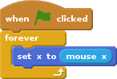

# Pong spielen

Bewege das Paddel, so dass der Ball nie den Boden berührt.

pong-game.png

## Pong spielen

Pong ist einer der älteste Computerspiele.

Ein Ball bewegt sich auf dem Bildschirm hin und her.

Bewege das Paddel, so dass der Ball nie den Boden berührt.

Wähle die entsprechende Figuren aus der Bibliothek oder zeichne deine eigene Figuren.

### Vorbereitung

Für das Spiel brauchst du:

- ein Ball,
- ein Paddel,
- ein Boden,
- und ein cooles Hintegrund.

### Programmierung

Beim drucken der grüne Flagge soll der Ball zuerst zur Anfangsposition gehen.

Dann soll der Ball anfangen, sich hin und her zu bewegen:

### Los geht's

Klicke auf die grüne Flagge und der Ball soll anfangen sich hin und her zu bewegen.

### Programmierung

Das Paddel soll unten am Bildschirm plaziert werden und dann sich von links nach rechts bewegen.

Das Paddle folgt die X-Koordinaten der Maus.

### Los geht's

### Programmierung

Der Ball soll prüfen, ob es das Paddel berührt.

Falls er es berührt, soll er zurückspringen:

### Programmierung

Und sobald der Ball den roten boden berührt, wird alles gestoppt!

### Zusatztipp

- Punkte zählen.
- Paddel mit der Tastatur bewegen.
- Der Ball unterschiedlich zurückspringen, ob er links, in der mitte oder rechts auf das Paddel prallt (Paddel einfärben oder unterschied bei der X-Koordinaten berechnen).
