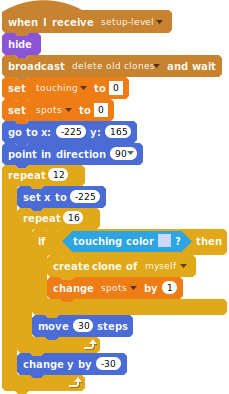
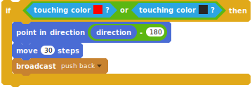
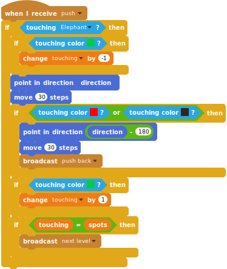

# Push Balls

Push all the balls on to the target spaces.

This tutorial is based on the [Sokoban game by Hiroyuki Imabayashi](https://en.wikipedia.org/wiki/Sokoban).

This version of the project is [shared on the Scratch site](https://scratch.mit.edu/projects/215391728) 

The SVG blocks can be exported with <http://scratchblocks.github.io/generator/#project=215391728> and the current sb2 downloaded with <http://getsb2.herokuapp.com/215391728>.

## Introduction


A elephant needs to push balls in to their correct locations.

The player controls the elephant using up/down/left/right keys

The goal is to get all the balls on to the targets.

You can create many levels of varying difficulty for the player to complete.

You will need for the game:

- a grid background (xy-grid-30px),
- an elephant
- a basketball

Pick the sprites from the library or draw them yourself.


## Make the elephant move

Make the elephant tiny so it fits inside one square on the grid-30px

Add a data variable "direction" which we will use to move the elephant and other objects.


```
(direction)
```


```
when [up arrow v] key pressed
set [direction v] to [0]
broadcast [move v]

when [down arrow v] key pressed
set [direction v] to [180]
broadcast [move v]

when [right arrow v] key pressed
set [direction v] to [90]
broadcast [move v]

when [left arrow v] key pressed
set [direction v] to [-90]
broadcast [move v]

when I receive [move v]
point in direction (direction)
move (30) steps
```

Test moving the elephant around using the keys

## Level 1 setup


Create a copy of the backdrop and give it a name "level-1". 

Hint select the backdrops tab and right click on the backdrop.

Draw the red borders. 

Add a small dot in one colour (light pink) to show the starting point of the elephant for this level.

Add dots in another colour (light blue) to show the starting point of the balls.

Add green spots to show where the balls have to be moved too.

We can create more levels later.

Add a new data variable called "level".


```
(level)
```

Start the game


```
when green flag clicked
set [level v] to [1]
switch backdrop to [level-1 v]
broadcast [setup-level v] and wait
```

## Move elephant to starting position


```
when I receive [setup-level v]
go to x: (-223) y: (167)
point in direction (90 v)
repeat (12) 
  set x to (-223)
  repeat (16) 
    if <touching color [#ffccf2] ?> then 
      show
      stop [this script v]
    end
    move (30) steps
  end
  change y by (-30)
end
```

Test if the elephant moves to the starting dot.

If it works add a hide at the beginning of the block of code and a show at the end.


```
hide
```
## Keep elephant inside the red lines

The elephant is not allowed to go on to the red lines.

Add code to move the elephant back if it touches the red line.


```
when I receive [move v]
point in direction (direction)
move (30) steps
if <touching color [#f00] ?> then 
  broadcast [push back v]
else 
  broadcast [push v] and wait
end
```

Note that the broadcast push will be used later to move the balls.

Now move the elephant back


```
when I receive [push back v]
point in direction ((direction) - (180))
move (30) steps
point in direction (direction)
```

Test that the elephant cannot move outside the lines

## Create balls in starting position

Create a data variable to keep count of the number of balls, 
and another to check if the balls are where they are supposed to be


```
(spots)
(touching)
```

Make the ball small enough to fit inside one square on the grid

Create a clone of the ball everywhere there is a light blue spot.



```
when I receive [setup-level v]
hide
broadcast [delete old clones v] and wait
set [touching v] to [0]
set [spots v] to [0]
go to x: (-225) y: (165)
point in direction (90 v)
repeat (12) 
  set x to (-225)
  repeat (16) 
    if <touching color [#ccd8ff] ?> then 
      create clone of [myself v]
      change [spots v] by (1)
    end
    move (30) steps
  end
  change y by (-30)
end
```

show only the clones


```
when green flag clicked
hide

when I start as a clone
show
```

Test if the balls are created correctly.

## Make the elephant push the balls

Every time the elephant moves it broadcasts a message "push".
If it is touching any balls they should also move in the same direction.


```
when I receive [push v]
if <touching [Elephant v] ?> then 
  point in direction (direction)
  move (30) steps 
end
```

Test if the code works, notice that the elephant can push the 
balls on to the red boundry and on to each other, let's fix 
this by moving the ball and the elephant back if necessary.



```
  if <<touching color [#f00] ?> or <touching color [#2a2725] ?>> then 
    point in direction ((direction) - (180))
    move (30) steps
    broadcast [push back v]
  end
```

Now lets keep count whenever we are touching one of the targets.

Extend the code block below as shown for when a clone of a ball is created.


```
when I start as a clone
show
if <touching color [#0c4] ?> then 
  change [touching v] by (1)
end
```

Extend the code both before and after the ball has moved



```
when I receive [push v]
if <touching [Elephant v] ?> then 
  if <touching color [#0c4] ?> then 
    change [touching v] by (-1)
  end
  point in direction (direction)
  move (30) steps
  if <<touching color [#f00] ?> or <touching color [#2a2725] ?>> then 
    point in direction ((direction) - (180))
    move (30) steps
    broadcast [push back v]
  end
  if <touching color [#0c4] ?> then 
    change [touching v] by (1)
  end
  if <(touching) = (spots)> then 
    broadcast [next level v]
  end
end

```

## Go to next level

Add a new copy of the background and draw a new level.


Program the background to go to next level


```
when I receive [next level v]
change [level v] by (1)
next backdrop
broadcast [setup-level v] and wait
```

Create a another copy of the backdrop but instead of creating 
a new level just write "Well Done"


## Retry current level


Add a new sprite which lets you retry the current level

## For the fun

Challenges

* change the color of the ball when its touching a target
* design your own levels
* copy level layout designs from [here](http://www.joriswit.nl/sokoban/junk/boxworld.html)
** note not all are possible due to grid size

## License

Creative Commons License CC-BY-SA  
Coderdojo Zürich, Ale Rimoldi  
Inspired by Brunus-V's Breakout game:  
https://github.com/Brunus-V/Scratch-games.

