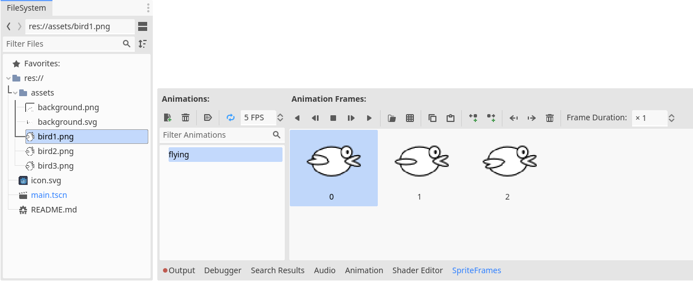

# Creating the main character

Before creating the main character, you should create the main scene.

- Create a new scene and add (_+ Other Node_) a _CharacterBody2D_ and rename it to `Bird`.
- Save the scene.
- Add to the `Bird` an _AnimatedSprite2D_
  - In the _Inspector_, go to the _AnimationSprite2D_ Section and under _Animation_, in _Sprite Frames_ activate _New SpriteFrames_.
  - Drag and drop the three `bird.png` assets into the _Animation Frames_ panel that is now shown at the bottom of the window when the _AnimatedSprite2D_ is active.
  - Set the name of the animation from `default` to `flying`.
  
- Add to the `Bird` a _CollisionShape2D_ node.
  - In the _Inspector_, in the _CollisionShape2D_ set the _Shape_ field to _New CapuseShape2D_.
  - In the _Node2D_ section, expand _Transorm_ and set the _Rotation_ to 90°.
  - On the canvas, use the handles of the _blueish_ shape to completely cover the sprite.
- In the left _Scene_ panel, click on the _Script_ button on the right of the panel's top toolbar and create the node's script by using _Object: Empty_ as the _Template_.
  - Add a few constants and variables defining the phyisics of the game:
    ```py
    const GRAVITY: int = 1000
    const MAX_VELOCITY: int = 600
    const FLAP_SPEED: int = -500
    var flying: bool = false
    var falling: bool = false
    const START_POSITION = Vector2(100, 400)
    ```
  - Add the function that handle the start of the game:  
    ```py
# Called when the node enters the scene tree for the first time
func _ready():
    reset()

# Reset the flags and the bird position
func reset():
    falling = false
    flying = false
    position = START_POSITION
    set_rotation(0)
    ```
  - Implement the bird's phyiscs:  
    ```py
func _physics_process(delta):
    # If it's in the air, apply gravity proportionally to the delta time elapsed
    if flying or falling:
        velocity.y += GRAVITY * delta
        # Limit to MAX_VELOCITY
        if velocity.y > MAX_VELOCITY:
            velocity.y = MAX_VELOCITY
        if flying:
            # Update and play the animation
            set_process_internal(deg_to_rad(velocity.y * 0.05))
            $AnimatedSprite2D.play()
        elif falling:
            # Face down and stop the animation
            set_rotation(PI / 2)
            $AnimatedSprite2D.stop()
        move_and_collide(velocity * delta)
    else:
        # The bird is not in the air
        $AnimatedSprite2D.stop()
    ```
  - Add a function to allow the bird to _flap_ up:  
    ```py
func flap():
    velocity.y = FLAP_SPEED
    ```
- You can now run the scene (not the project!) and see the bird. It does not fly yet.
- Activate the main scene by clicking on the `main` tab.
- Instantiate the `Bird` by clicking on the _chain_ button in the Scene's top toolbar.
- Add a script to the `Main` scene (this time we use the _Node: Default_ template, as suggested in the dialog)
  - Add the variable and constants controlling the game state and physics:  
    ```py
var game_running: bool
var game_over: bool
var scroll
var score
var SCROLL_SPEED: int = 4
var screen_size: Vector2i
var ground_height: int
var pipes: Array
const PIPE_DELAY: int = 100
const PIPE_RANGE: int = 200
    ```
  - Add the functions for resetting the game state:  
    ```py
# Called when the node enters the scene tree for the first time.
func _ready():
    new_game()

# Reset the game state
func new_game():
    game_running = false
    game_over = false
    score = 0
    scroll = 0
    Bird.reset()
    ```

  - Detect the mouse click to start and to flap:  
    ```py
func _input(event):
    if event.is_action_pressed("ui_cancel"):
        get_tree().quit()
    
    if game_over == false:
        # If the game is running and the mouse gets clicked
        if event is InputEventMouseButton:
            if event.button_index == MOUSE_BUTTON_LEFT and event.pressed:
                if game_running == false:
                    start_game()
                else:
                    if $Bird.flying:
                        # TODO: ale: does not look up and down (rotate)
                        $Bird.flap()

func start_game():
    game_running = true
    $Bird.flying = true
    $Bird.flap()
    ```
