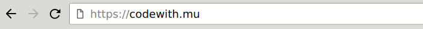

# Mu und Pygame Zero installieren

Für deine ersten Schritte in Python, kannst du den Mu Editor installieren. 

Es enthält alles, was du zum Starten brauchst:

* Python 3,
* Pygame (die Lernversion "Zero"),
* Der Mu-Editor.

Öffne den Browser und gehe zu: <https://codewith.mu>

... Klicke auf den grünen Download-Knopf des Installationsprogramms für  Windows 64 Bit oder der .dmg-Datei für Mac. 
Für die Installationsdetails bitte klicke auf "Instructions" , die du neben deine Plattform findest:

Auf Linux nutze den Paket-Manager oder pip, um mu-Editor zu installieren.
