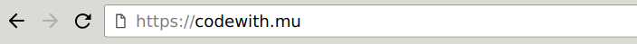

# Installing Mu and Pygame Zero

For your first steps with Python, you can simply install the Mu editor.

It comes with everything you need to start:

– Python 3,
– Pygame (the educational "Zero" version),
– The Mu editor.

Open your browser and go to <https://codewith.mu>

... Click on the green download button the installer for Windows 64bit or the .dmg file for Mac.
For the install details, please click on the "Instructions" button next
to your platform:

On Linux, use the package manager or pip to install mu-editor.
