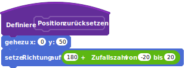
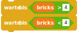
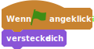
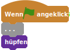

# Breakout

## Bewege den Paddel


```
Wenn die grüne Flagge angeklickt
gehe zu x: (0) y: (-150)
wiederhole fortlaufend 
  setze x auf (Maus x-Position)
end
```

## Ein hüpfender Ball


```
(Geschwindigkeit)
```


```
Wenn die grüne Flagge angeklickt
setze [Geschwindigkeit v] auf [8]
gehe zu x: (0) y: (50)
setze Richtung auf ((180) + (Zufallszahl von (-20) bis (20)))
zeige dich
wiederhole fortlaufend 
  gehe (Geschwindigkeit) er-Schritt
  pralle vom Rand ab
  . . .
end
```

## Das Paddel und der Ball


```
setze y auf (([y position v] of [Paddel v]) + (20))
  drehe dich zu [Paddel v]
  drehe dich nach links um (180) Grad
end
```

## Ein Leben verlieren


```
(Bälle)
```


```
Wenn die grüne Flagge angeklickt
. . .
setze [Bälle v] auf [3]
```


```
falls <(y-Position) < ([y-Position v] von [Paddel v])> dann 
  verstecke dich
  ändere [Bälle v] um (-1)
  gehe zu x: (0) y: (50)
  setze Richtung auf ((180) + (Zufallszahl von (-20) bis (20)))
  zeige dich
  warte (2) Sek.
end
```

## Refactoring



```
Definiere Position zurücksetzen
gehe zu x: (0) y: (50)
setze Richtung auf ((180) + (Zufallszahl von (-20) bis (20)))
```


```
setze [Geschwindigkeit v] auf [8]
setze [Bälle v] auf [3]
Position zurücksetzen :: custom
zeige dich
```


```
verstecke dich
ändere [Bälle v] um (-1)
warte (2) Sek.
Position zurücksetzen :: custom
zeige dich
```

## Spielende


```
Wenn die grüne Flagge angeklickt
verstecke dich
warte bis <(Bälle) > [1]>
warte bis <(Bälle) < [1]>
zeige dich
stoppe [alles v]
```

## Zeichne die Ziegelsteine


```
Wenn die grüne Flagge angeklickt
verstecke dich
gehe zu x: (-210) y: (160)
```


```
Wenn die grüne Flagge angeklickt
. . .
setze [Ziegelsteine v] auf [0]
setze [Reihe v] auf [0]
wiederhole (3) mal 
  setze [Spalte v] auf [0]
  wiederhole (13) mal 
    erzeuge Klon von [mir selbst v]
    ändere [Spalte v] um (1)
  end
  ändere [Reihe v] um (1)
end
```


```
Wenn ich als Klon entstehe
gehe zu x: ((-210) + ((35) * (Spalte))) y: ((160) - ((20) * (Reihe)))
zeige dich
ändere [Ziegelsteine v] um (1)
```


```
warte bis <(Ziegelsteine) = [39]>
```

## Ziegelsteine treffen


```
warte bis <wird [Ball v] berührt?>
ändere [Ziegelsteine v] um (-1)
lösche diesen Klon
```


```
falls <wird [Ziegelsgtein v] berührt?> dann 
  setze Richtung auf ((180) - (Richtung))
end
```

## Der Gewinner


```
Wenn die grüne Flagge angeklickt
verstecke dich
warte bis <(Zigelsteine) > [0]>
warte bis <(Zigelsteine) = [0]>
zeige dich
stoppe [alles v]
```

# Farbige Ziegelsgteine


```
Definiere Farbe setzen
wechsle zu Kostüm ((Reihe) + (1))
falls <(Reihe) = [1]> dann 
  falls <<(Spalte) = [ 3 ]> oder <<(Spalte) = [ 6 ]> oder <(Spalte) = [9]>>> dann 
    wechsle zu Kostüm [Grau v]
  end
end
```


```
Wenn ich als Klon entstehe
. . .
Farbe setzen :: custom
zeige dich
. . .
falls <nicht <(Kostumnummer) = [4]>> dann 
  warte bis <wird [Ball v] berührt?>
  . . .
  lösche diesen Klon
end
```

## Gewinner @ 3



```
warte bis <(bricks) > [4]>
warte bis <(bricks) < [4]>
```

## Die Pillen falle


```
(Bonus Start X)
```


```
(Bonus Start Y)
```


```
setze [Bonus Start X v] auf (x-Position)
setze [Bonus Start Y v] auf (y-Position)
sende [Bonus fällt v] an alle
```



```
when green flag clicked
hide
```


```
Wenn ich [Bonus fällt v] empfange
erzeuge Klon von [mir selbst v]
```


```
(Bonus)
```


```
Wenn ich als Klon entstehe
setze [Bonus v] auf (Zufallszahl von (1) bis (12))
falls <(Bonus) > [3]> dann 
  lösche diesen Klon
end
```


```
wechsle zu Kostüm (Bonus)
gehe zu x: (Bonus start X) y: (Bonus start Y)
zeige dich
wiederhole bis <(y-Position) < ([y-Position v] von [Paddel v])> 
  ändere y um (-6)
  falls <wird [Paddel v] berührt?> dann 
    . . .
    lösche diesen Klon
  end
end
lösche diesen Klon
```

## Bonus: ein breites Paddel


```
falls <(Bonus) = [1]> dann 
  sende [Bonus Breites Paddel v] an alle
end
```


```
Wenn ich [Bonus Breites Paddel v] empfange
falls <(Kostumnummer) = [1]> dann 
  wechsle zu Kostüm [Breit v]
  warte (10) Sek.
  wechsle zu Kostüm [Normal v]
end
```


```
Wenn die grüne Flagge angeklickt
wechsle zu Kostüm [Normal v]
. . .
```

## Bonus: ein langsamer Ball


```
falls <(Bonus) = [2]> dann 
  sende [Bonus langsamer Ball v] an alle
end
```


```
Wenn ich [Bonus langsamer Ball v] empfange
falls <(Geschwindigkeit) = [8]> dann 
  setze [Geschwindigkeit v] auf [5]
  warte (10) Sek.
  setze [Geschwindigkeit v] auf [8]
end
```

## Bonus: Extra Bälle


```
falls <(Bonus) = [3]> dann 
  sende [Bonus extra Ball v] an alle
end
```


```
Wenn ich [Bonus extra Ball v] empfange
falls <(Kostumnummer) = [1]> dann 
  erzeuge Klon von [Ball v]
end
```


```
Wenn ich als Klon entstehe
wechsle zu Kostüm [Extra v]
Position zurücksetzen :: custom
hüpfen :: custom
```


```
Definiere hüpfen
wiederhole fortlaufend 
  . . .
end
```


```
Wenn die grüne Flagge angeklickt
. . .
wiederhole fortlaufend 
  . . .
end
```



```
Wenn die grüne Flagge angeklickt
. . .
hüpfen :: custom
```


```
Definiere hüpfen
. . .
falls <(y-Position) < ([y-Position v] of [Paddel v])> dann 
  . . .
end
```


```
if <(y position) < ([y position v] of [paddle v])> then 
  if <(costume #) = [1]> then 
    ...
  else 
    delete this clone
  end
end
```

