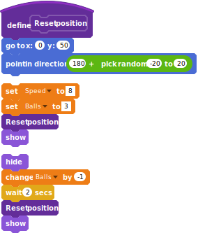
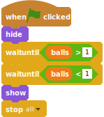

# Breakout

Ein Ball hüpft herum.

Verhindere mit dem Paddel, dass der Ball nicht fällt und den Boden berührt.

Das Ziel ist alle Backsteine mit dem Ball zu treffen.

Für dieses Spiel brauchst du:

- einen Ball,
- ein Paddel
- ein breites Paddel,
- verschiedenfarbige Ziegelsteine,
- Pillen mit Superkräften.

Wähle die Sprites aus der Sammlung oder male diese selbst.


## Bewege das Paddel

Male ein Paddel oder wähle eins aus der Scratch Sammlung. Platziere es am unteren Rand deines Bildschirmes.


```
when green flag clicked
go to x: (0) y: (-150)
forever 
set x to (mouse x)
end
```

## Ein hüpfender Ball

Setze zunächst die Variable für die Sprite Geschwindigkeit, die
Position und die Richtung, damit der Ball beim Spielstart nach unten
fällt.

Bewege den Ball mit der definierten Geschwindigkeit und lasse es vom
Rand abprallen.

Schaue auf der folgenden Seite die Instruktionen für das Abprallen am
Paddel...


```
(speed)
```

... füge dem Ball die  "wiederhole fortlaufen" Schleife zu.


```
when green flag clicked
set [Speed v] to [8]
go to x: (0) y: (50)
point in direction ((180) + (pick random (-20) to (20)))
show
forever 
  move (speed) steps
  if on edge, bounce
  ...
end
```

Wenn der Ball das Paddel berührt, dann wird es nach links oder rechts
abprallen, je nach dem welche Seite des Paddels berührt wird. mehr
oder weniger steil, abhängig wie nah der Ball die Mitte des Paddels
berührt.

- Bewege zunächst den Ball um 20 px nach oben, damit es das Paddel nicht mehr berührt.
- Dann zeige auf die Mitte des Paddels.
- Zum Schluss kehre die Richtung (drehe um 180°)

```
if <touching [Paddle v] ?> then 
  set y to (([y position v] of [Paddle v]) + (20))
  point towards [Paddle v]
  turn ccw (180) degrees
end
```

## Versuche es!

Klicke auf die Gründe Flagge: Der Ball wird herumhüpfen und das Paddel
wird deinem Mauszeiger folgen.


## Ein Leben verlieren 

Wenn der Ball unter dem Paddel fällt, verringere die Anzahl
Leben. Danach geht der Ball zurück zur Anfangsposition.

Erstelle zunächst die "Ball" Variable (für alle Sprites) und
initialisiere es mit der Anzahl Leben.


```
(Balls)
```


```
When Flag clicked
...
set [balls v] to [3]
```


```
if <(y position) < ([y position v] of [Paddle v])> then 
  hide
  change [balls v] by (-1)
  go to x: (0) y: (50)
  point in direction ((180) + (pick random (-20) to (20)))
  show
  wait (2) secs
end
```

In der Endlosschleife auf Seite 2 prüfen wir ob die Position des Balls
unter dem Paddel liegt. Falls ja, dann verkleinern wir die Anzahl
Leben und - nach zwei Sekunden - bewegen den Ball zurück zur
Anfangsposition.


## Refactoring

Vielleicht ist dir aufgefallen, dass der Code für die Initialisierung
sehr ähnlich ist wie jenes, um die Position zurück zu stellen, wenn
der Ball nicht berührt wird.

Lass uns den Code verbessern und ein "Position zurücksetzen" Block erstellen.


```
define Reset position
go to x: (0) y: (50)
point in direction ((180) + (pick random (-20) to (20)))
```

Wir können nun "Position zurücksetzen" sowohl für die
"Initialisierung" als auch für das Rückstellen auf die Anfangsposition
verwenden:


```
set [Speed v] to [8]
set [Balls v] to [3]
Reset position :: custom
show
```


```
hide
change [Balls v] by (-1)
wait (2) secs
Reset position :: custom
show 
```



## Spielende

Wir prüfen die verbleibende Anzahl Leben und lösen ein "Game over"
aus, wenn wir alle Bälle verloren haben.

Warte zuerst, bis mindestens ein Ziegelstein geklont wurde, sonst wird
das Spiel so schnell beendet wie es gestartet wurde.



```
when green flag clicked
hide
wait until <(balls) > [1]>
wait until <(balls) < [1]>
show
stop [all v]
```

## Zeichne die Ziegelsteine

Jetzt malen wir drei Reihen Ziegelsteine.  Wir zeichnen zuerst den
Ziegelstein Null. Wir verstecken es und platzieren es irgendwo am
oberen linken Rand.


```
when green flag clicked
hide
go to x: (-210) y: (160)
```

Wir haben einige Berechnungen gemacht und wenn unsere Ziegelsteine 30
mal 15 Pixel gross sind, dann haben sie 13 Spalten und 3 Reihen Platz.

Wir überwachen die Anzahl Ziegelsteine, die Spalten und die
Zeilen. Wir erstellen jeden Ziegelstein als Klon des Ziegelsteins
Null.

Achtung: Spalte und Reihe gelten nur für den Sprite. So weiss jeder
Ziegelstein wo es sich befindet.

"Ziegelsteine" ist eine globale Variable.


```
when green flag clicked
...
set [bricks v] to [0]
set [row v] to [0]
repeat (3) 
  set [column v] to [0]
  repeat (13) 
    create clone of [myself v]
    change [column v] by (1)
  end
  change [row v] by (1)
end
```

Jede Spalte ist 35 Breit und die Reihen 20 hoch.

Jede Position eines Klons wird errechnet, indem man dem Index (Spalte
oder Reihe) den Ursprung hinzufügt, multipliziert mit der Breite oder
Höhe.


```
when I start as a clone
go to x: ((-210) + ((35) * (column))) y: ((160) - ((20) * (row)))
show
change [bricks v] by (1)
```

Spalte und Reihe starten bei 0, nicht 1.

Füge ein "warte" zwischen "zurücksetzen" und "hüpfen"


```
wait until <(bricks) = [39]>
```

## Ziegelsteine berühren

Füge es dem Code "wenn ich einen Klon starte" hinzu.


```
wait until <touching [ball v] ?>
change [bricks v] by (-1)
delete this clone
```

Wenn der Ball einen Ziegelstein berührt, dann verschwindet es...

Füge es der "Wiederhole fortlaufend" Schleife hinzu.


```
if <touching [brick v] ?> then 
  point in direction ((180) - (direction))
end
```

... und wenn der Ball den Ziegelstein berührt, dann ändert es seine
Richtung.

(Falls der Ziegelstein nicht verschwindet, dann warte 0.1 Sekunden vor
dem Richtungswechsel.)

## Der Gewinner

Der "Gewinner" Sprite ist versteckt und wartet bis die Anzahl der
Ziegelsteine Null ist. Erst danach erscheint es.


```
when green flag clicked
hide
wait until <(bricks) > [0]>
wait until <(bricks) = [0]>
show
stop [all v]
```

Warte zuerst, bis mindestens ein Ziegelstein angezeigt wird, sonst
endet das Spiel bevor es richtig angefangen hat.

### Farbige Ziegelsteine

Wir setzen unterschiedliche Farben für jede Reihe, und in der zweiten
Reihe füge drei graue Ziegelsteine, die nicht zerstört werden können.


Erstelle 4 Kostüme mit verschiedenen Farben, wobei das vierte grau
ist.


```
define Set Style
switch costume to ((row) + (1))
if <(row) = [1]> then 
  if <<(column) = [ 3 ]> or <<(column) = [ 6 ]> or <(column) = [9]>>> then 
    switch costume to [gray v]
  end
end
```

Füge "setze Stil" hinzu, bevor der Klon angezeigt wird...

Setze ein "falls" zwischen den Blöcken "warte bis" und "lösche diesen
Klon"


```
when I start as a clone
...
Set Style :: custom
show
...
if <not <(costume #) = [4]>> then 
  wait until <touching [ball v] ?>
  ...
  delete this clone
end
```

## Gewonnen bei 3

Im "Gewinner", warte bis 3 Ziegelsteine übrig sind, nicht null.


```
wait until <(bricks) = [3]>
```


## Die Pillen fallen

Wenn der Ball den Ziegelstein berührt, dann gibt es eine
Wahrscheinlichkeit von eins zu vier, dass eine fallende Pille
erscheint. Wenn der/die Spieler/in die fallende Pille fängt, dann
bekommt er/sie einen Bonus.


```
(bonus start X)
```


```
(bonus start Y)
```


```
set [bonus start X v] to (x position)
set [bonus start Y v] to (y position)
broadcast [Drop bonus v]
```

– Erstelle die globalen Variablen "bonus Start X" und "bonus Start Y"
– Gegen das Ende von "Wenn ich einen Klon starte", vor dem Löschen eines Klones...
- ... Setze "bonus Start X" auf die aktuelle "xposition" and "bonus Start Y" auf die "y position"
- Sende die "Bonus fällt" Nachricht

## Die Pillen fallen 2 

Zeichne eine Pille. Wenn das Spiel startet ist sie versteckt und wenn
der Ziegelstein die Nachricht "Bonus fällt" verschickt, dann klont es
sich selbst.


```
when green flag clicked
hide
```


```
when I receive [Drop bonus v]
create clone of [myself v]
```

## Die Pillen fallen 3

Erstelle eine "Bonus" Sprite Variable.  

Wenn die Zufallszahl grösser ist als 3 (3 von 4 Möglichkeiten), dann
mache nichts und lösche den Klon...


```
(bonus)
```


```
when I start as a clone
set [bonus v] to (pick random (1) to (12))
if <(bonus) > [3]> then 
  delete this clone
end
```

1 zu 12? Wir haben 3 Boni und eine 1/4 Chance:  
3 * 4 = 12

... sonst bewege dich zur Stelle, wo der Ziegelstein war, erscheine
dort und falle runter bis nach dem Paddel (oder berühre es)


```
switch costume to (bonus)
go to x: (Bonus start X) y: (Bonus start Y)
show
repeat until <(y position) < ([y position v] of [paddle v])> 
  change y by (-6)
  if <touching [paddle v] ?> then 
    ...
    delete this clone
  end
end
delete this clone
```

Wir benötigen drei Kostüme. 

Sende von hier aus die Bonus Nachricht... 

## Bonus: ein breites Paddel

Wenn der/die Spieler/in einen "Breiten Paddel" Bonus (die Nummer 1)
fängt, wird das Paddel breiter. Nach 10 Sekunden schrumpft es wieder
zur normalen Grösse.


```
if <(bonus) = [1]> then 
  broadcast [bonus wide paddle v]
end
```

Füge die Nachricht zum "wenn Paddel berührt" hinzu.


## Bonus: ein breites Paddel

Das Paddel hört auf die "Bonus Breiter Paddel" Nachricht. Danach
wechselt es zu einem Kostüm mit einem breiteren Paddel und wartet 10
Sekunden bevor es wieder zur normalen Grösse schrumpft.


```
when I receive [bonus wide paddle v]
if <(costume #) = [1]> then 
  switch costume to [wide v]
  wait (10) secs
  switch costume to [normal v]
end
```


```
When Flag clicked
switch costume to [normal v]
...
```

## Bonus: ein langsamer Ball

Wenn der/die Spieler/in einen "Langsamer Ball" (die Nummer 2)
Bonus fängt, dann verlangsamt sich die Geschwindigkeit des Balls.


```
if <(bonus) = [2]> then 
  broadcast [bonus slow ball v]
end
```

## Bonus: ein langsamer Ball 2

Der Ball hört auf die Nachricht "Bonus Langsamer Ball". Dann, falls
die aktuelle Geschwindigkeit die normales ist, setze die Variable zum
tieferen Wert, warte 10 Sekunden, bevor der Wert der Geschwindigkeit
wieder auf den normalen Level gesetzt wird.


```
when I receive [bonus slow ball v]
if <(speed) = [8]> then 
  set [speed v] to [5]
  wait (10) secs
  set [Speed v] to [8]
end
```

## Bonus: Extra Bälle

Jedes Mal wenn der/die Spieler/in einen "Extra Ball" Bonus (die Nummer
3) fängt, dann erscheint ein zusätzlicher hüpfender Ball.


```
if <(bonus) = [3]> then 
  broadcast [bonus extra ball v]
end
```

## Bonus: Extra Bälle 2

Der Ball hört auf die Nachricht "Bonus Extra Ball". Falls das Kostüm
das übliche ist, dann kreiere einen Klon.

Was macht der Klon? Es wechselt das Kostüm auf "extra", geht auf die
Startposition und beginnt zu hüpfen.


Refactoring: Der Ball und der Klone hüpfen parallel. 


```
when I receive [bonus extra ball v]
if <(costume #) = [1]> then 
  create clone of [ball v]
end
```


```
when I start as a clone
switch costume to [extra v]
Reset position :: custom
Bounce :: custom
```


```
define Bounce
forever 
  ...
end
```


```
When Flag clicked
...
forever
  ...
end
```

## Bonus: Extra Bälle 3

Zum Schluss verlieren wir nur ein Leben, wenn der Originalball hinter
dem Paddel fällt. Die Klone "verschwinden" einfach.


```
define Bounce
...
if <(y position) < ([y position v] of [paddle v])> then 
  ...
end
```


```
When Flag clicked
...
Bounce :: custom
```


```
if <(y position) < ([y position v] of [paddle v])> then 
  if <(costume #) = [1]> then 
    ...
  else 
    delete this clone
  end
end
```

## Lizenz

Creative Commons License CC-BY-SA  
Coderdojo Zürich, Ale Rimoldi  
Inspired by Brunus-V's Breakout game:  
https://github.com/Brunus-V/Scratch-games.

