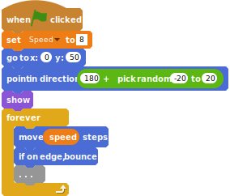
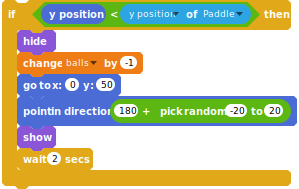
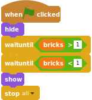

# Breakout

This tutorial is based on the [Breakout game by Brunus-V](https://github.com/Brunus-V/Scratch-games).

My version of the project is [shared on the Scratch site](https://scratch.mit.edu/projects/201595840) and can you can also [play it with sulfurous](https://sulfurous.aau.at/legacy/#201595840) (look ma, no flash!)

The SVG blocks can exported with <http://scratchblocks.github.io/generator/#project=201595840> and the current sb2 downloaded with <http://getsb2.herokuapp.com/201595840>.

## Create the paddle

create a paddle that follows the mouse:

- you can pick the paddle from the scratch library or draw your own
- resize it to about 50 px width
- place it about towards the bottom of the screen (0, -150)


```
when green flag clicked
switch costume to [normal v]
go to x: (0) y: (-150)
forever 
set x to (mouse x)
end
```

## Create the bouncing ball

Create a ball that moves around randomly

- create the "speed" sprite variable
- initialize the speed, the position and the direction so that the ball starts by going down. make it visible
- forever:
  - move the ball at its speed
  - bunce on edges
  - if it touches the paddle bounce to the left or to the right, depending on which part of the paddle is touched
    - go up, 20 px above the paddle
    - look (point) to the center of the paddle
    - turn upside down (turn by 180°)



```
when green flag clicked
set [Speed v] to [8]
go to x: (0) y: (50)
point in direction ((180) + (pick random (-20) to (20)))
show
forever 
  move (speed) steps
  if on edge, bounce
  if <touching [Paddle v] ?> then 
    set y to (([y position v] of [Paddle v]) + (20))
    point towards [Paddle v]
    turn ccw (180) degrees
  end
end
```


## Lose a life when the ball is missed

When the ball goes below the paddle, decreate the number of life and reste the ball position

- create the "Ball" variable (for all sprites)
- initialize it when the green flag has been clicked
- in the forever loop if the vertical postion (y) of the ball is lower than the paddle's position
  - hide the ball
  - decrease the value of "Balls"
  - wait two seconds
  - move it up to the start position
  - point down
  - show the ball



```
set [Balls v] to [3]

if <(y position) < ([y position v] of [Paddle v])> then 
  hide
  change [Balls v] by (-1)
  wait (2) secs
  go to x: (0) y: (50)
  point in direction ((180) + (pick random (-20) to (20)))
  show
end
```

## Refactoring

You might have noticed that the code for the initialization is very similar to the one for resetting the position after the ball has been lost. Let's refactor the code and create a "Reset position" block that we cana use in both places.

```
define Reset position
go to x: (0) y: (50)
point in direction ((180) + (pick random (-20) to (20)))

set [Speed v] to [8]
set [Balls v] to [3]
Reset position :: custom
show

hide
change [Balls v] by (-1)
wait (2) secs
Reset position :: custom
show 
```


## Game Over when no more balls

- Add a "Game Over" sprite
- When the Green flat is clicked:
  - Hide it
  - Wait for everything beeing initialized (2 seconds?)
  - Wait for balles becoming smaller than 0
  - When that happens, show itself and stop all scripts


```
when green flag clicked
hide
wait until <(Balls) < [0]>
show
stop [all v]
```

## For the fun: Show the remaining balls

We want to show the remaining balls in the lower left corner.

- Create a new sprite "1 Up" and copy the Ball's costume into it (or draw a new costume for counting the points)
- When the game is started:
  - Go to the lower corner
  - Show the ball
  - Wait until the number of balls has been initialized by the main ball
  - As soon as the number of balls has fallen below the remaining balls represented by this ball (in this case 1... we are counting from the right)...
  - ... Hide the sprite
- Duplicate two time the "1 Up" sprite
  - rename it to "2 Up"
  - the position 20 px to the right of the previous one
  - wait for the right number of remaining balls (2 for the second ball...)
- Duplicate two time the "2 Up" sprite
  - wait for the right number of remaining balls (3 for the second ball...)


```
when green flag clicked
go to x: (-230) y: (-170)
show
wait until <(Balls) > [0]>
wait until <(Balls) < [1]>
hide

when green flag clicked
go to x: (([x position v] of [Ball 1 Up v]) + (20)) y: (-170)
show
wait until <(Balls) > [0]>
wait until <(Balls) < [2]>
hide

when green flag clicked
go to x: (([x position v] of [Ball 2 Up v]) + (20)) y: (-170)
show
wait until <(Balls) > [0]>
wait until <(Balls) < [3]>
hide
```

## Drawing the bricks

We draw a brick in the top left corner and then make 39 copies of it: 3 rows and 13 columns.

- Draw the first brick
- Create the "Row" and "Column" variables (for this sprite only)
- Create a "Bricks" global variable to keep track of the number of bricks that are visible
- When starting
  - place the brick in the left top corner and hide it.
  - for 3 rows and 13 columns:
    - create a clone while keeping track on which Row and Column we are
- When it starts as a clone:
  - go to a position that is "Column" times the width of the brick (35 pixels) and "Row" times the height of the brick (20), starting from the top left corner.
  - increase the number of bricks
- You will notice that the ball starts before all the bricks have been drawn: In the Ball sprite, add a wait, after the position has been reset and before the ball is being shown.


```
when I start as a clone
go to x: ((-210) + ((35) * (Column))) y: ((160) - ((20) * (Row)))
show
change [Bricks v] by (1)

when green flag clicked
hide
go to x: (-210) y: (160)
set [Bricks v] to [0]
set [Row v] to [0]
repeat (3) 
  set [Column v] to [0]
  repeat (13) 
    create clone of [myself v]
    change [Column v] by (1)
  end
  change [Row v] by (1)
end

wait until <(Bricks) = [39]>
```

## Hitting the bricks

When a brick is hit by the ball it disappears. When a ball hits a brick it inverts its direction.

- In each Brick's "When I start of a clone" add at the end:
  - Wait for touching Ball
  - Delete the clone
- In the Ball's "Forever" loop add an "If" touching a brick:
  - change the direction by 180° minus the current direction (it will continue in the same horizontal direction but "upside down")


```
wait until <touching [Ball v] ?>
change [Bricks v] by (-1)
delete this clone

if <touching [Brick v] ?> then 
  point in direction ((180) - (direction))
end
```

## Winning the game

When no bricks are shown anymore, the player has won.

- Add a "Winner" sprite
- When the Green flat is clicked:
  - Hide it
  - Wait for the bricks being 39
  - Wait for brciks becoming 0 again
  - When that happens, show itself and stop all scripts



```
when green flag clicked
hide
wait until <(Bricks) = [39]>
wait until <(Bricks) = [0]>
show
stop [all v]
```

## Bonus: the falling brick

When a brick is the, the player has one chance in six to get a falling brick. If the player catches the falling brick, she'll get the matching bonus.

- In the Brick:
  - Create the global variables "Bonus Start X" and "Bonus Start Y"
  - Towards the end of "When I start as a clone, just before deleting the clone...
  - Set "Bonus Start X" to the current "x position" and "Bonus Start Y" to the "y position"
  - broadcast the "Drop Bonus" Message
- Create a "Bonus" asset with three costumes of different colors.
  - When the program starts it hides itself.
  - When it receives the "Drop Bonus" message
    - creates a clone of itself
  - Define a "Bonus" local variable
  - When starts a clone:
    - Goes to to global variables "Bonus Start X", "Bonus Start Y"
    - Set the "Bonus" variable to a random value between 1 and 6
    - If the value of bonus is smaller than 4
      - Switch to the costume with the same number (from 1 to 3)
      - Otherwise delete the cone
    - Show the bonus clone
    - repeat until it gets below the Paddle:
      - move down by 6 pixels
      - if it's touching the Paddle
        - Here we will send messages for the bonuses
        - Delete the clone, we're done
    - Delete the clone when we got below the paddle


```
set [Bonus Start X v] to (x position)
set [Bonus Start Y v] to (y position)
broadcast [Drop Bonus v]

when green flag clicked
hide

when I receive [Drop Bonus v]
create clone of [myself v]

when I start as a clone
go to x: (Bonus Start X) y: (Bonus Start Y)
set [Bonus v] to (pick random (1) to (6))
if <(Bonus) < [4]> then 
  switch costume to (Bonus)
else 
  delete this clone
end
show
repeat until <(y position) < ([y position v] of [Paddle v])> 
  change y by (-6)
  if <touching [Paddle v] ?> then 
    delete this clone
  end
end
delete this clone
```

## Bonus: a wider paddle

When the player catches a "Wide Paddle" bonus, the paddle gets wider. It will return to the normal size after 10 seconds.

- In the Bonus: 
  - In "If touching paddle" add (before deleting the clone):
    - if bonus = 1 then
      - broadcast "Bonus Wide Palette"
- In the Paddle:
  - Draw a new costume with a paddle which is twice a wide as the normal one.
  - Wait for the message "Bonus Wide Paddle"
    - If the paddle is not yet wide
      - Change the costume to "Wide"
      - Broadcast a "Coundown Wide Paddle" message that we will catch in the paddle itself (
  - Wait for the message "Coundown Wide Paddle"
    - Wait 10 seconds
    - Change the costume back to "Normal"
(We have to send a message to ourselves, otherwise the "When I Receive "Bonus Wide Paddle" will be blocked until the 10 seconds are over, and then process the messages that have been received during the 10 seconds: and the paddle always stays wide...)


```
if <(Bonus) = [1]> then 
  broadcast [Bonus Wide Paddle v]
end

when I receive [Bonus Wide Paddle v]
if <(costume #) = [1]> then 
  switch costume to [Wide v]
  broadcast [Countdown Wide Paddle v]
end

when I receive [Countdown Wide Paddle v]
wait (10) secs
switch costume to [Normal v]
```

## Bonus: slow ball

When the player catches a "Slow Ball" bonus, the ball slows down. It will return to the normal speed after 10 seconds.

- In the Bonus: 
  - In "If touching paddle" add (before deleting the clone):
    - if bonus = 2 then
      - broadcast "Bonus Slow Ball"
- In the Ball:
  - Wait for the "Bonus Slow Ball" message
    - If the ball is not slow yet
    - Set the speed to 5
    - Broadcast a "Coundown Slow Ball" message that we will catch in the ball itself
  - Wait for the "Coundown Slow Ball" message
      - Wait 10 seconds
      - Change the speed back to 8


```
if <(Bonus) = [2]> then 
  broadcast [Bonus Slow Ball v]
end

when I receive [Bonus Slow Ball v]
if <(Speed) = [8]> then 
  set [Speed v] to [5]
  broadcast [Countdown Slow Ball v]
end

when I receive [Countdown Slow Ball v]
wait (10) secs
set [Speed v] to [8]
```

## Bonus: Extra ball

When the player catches an "Extra Ball" bonus, a new ball will start bumping around. It will disappear when it drops below the paddle

- In the Bonus: 
  - In "If touching paddle" add (before deleting the clone):
    - if bonus = 3 then
      - broadcast "Bonus Extra Ball"
- In the Ball:
  - Create a new costume with a ball with a different color
  - Wait for the "Bonus Extra Ball" message
    - If the costume is 1 (otherwise the clones are also cloned...)
      - create clone of itself
  - When it starts as a clone
    - Switch to the "Extra" costume
    - run the "Reset position" block
  - Create a "Bounce" block
  - Move the "forever" loop in "when starting" to the "Bounce" Block and add the "Bounce" command at the end of the forever loop.
  - Add the Bounce command at the end of "When I start as a clone"
  - When checking if the position of the ball is below of the Paddel:
    - If costume = 1
      - reduce the number of balls and reset the position (as it was before)
    - Else
      - Delete the clone


```
if <(Bonus) = [3]> then 
  broadcast [Bonus Extra Ball v]
end

when green flag clicked
...
show
Bounce :: custom

define Bounce
forever 
  ...
  if <(y position) < ([y position v] of [Paddle v])> then 
    if <(costume #) = [1]> then 
      ...
    else 
      delete this clone
    end
  end
  ...
end

when I receive [Bonus Extra Ball v]
if <(costume #) = [1]> then 
  create clone of [Ball v]
end

when I start as a clone
switch costume to [Extra v]
Reset position :: custom
Bounce :: custom

if <(y position) < ([y position v] of [Paddle v])> then 
  if <(costume #) = [1]> then 
    ...
  else 
    delete this clone
  end
end
```

### Bricks with diffent colors and behaviors

We set different colors for each row and on the second row add three gray bricks that cannot be distroyed.

- Duplicate three the Brick's costume and set different colors; the last one is the gray one.
- Create a gray brick that won't be distroyed
- Create the block "Set Style"
  - Set the costume number to the value of Row + 1
  - If row = 1 (the first row is 0, not 1)
    - If column = 3 or 6 or 9:
- In "when starting as a clone",
  - call "Set Style" before showing the Sprite
  - put the code after "wait until touchging ball" in a condition "if not costume = 4"
- In the "winner" block increase the number of Bricks needed to finish to 3 instead of 0


```
define Set Style
switch costume to ((Row) + (1))
if <(Row) = [1]> then 
  if <<(Column) = [ 3 ]> or <<(Column) = [ 6 ]> or <(Column) = [9]>>> then 
    switch costume to [Gray v]
  end
end

when I start as a clone
...
Set Style :: custom
show
...
if <not <(costume #) = [4]>> then 
  wait until <touching [Ball v] ?>
  ...
  delete this clone
end
```
