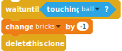

# Breakout

Hit all the bricks with the bouncing ball.

This tutorial is based on the [Breakout game by Brunus-V](https://github.com/Brunus-V/Scratch-games).

My version of the project is [shared on the Scratch site](https://scratch.mit.edu/projects/201595840) and can you can also [play it with sulfurous](https://sulfurous.aau.at/legacy/#201595840) (look ma, no flash!)

The SVG blocks can be exported with <http://scratchblocks.github.io/generator/#project=201595840> and the current sb2 downloaded with <http://getsb2.herokuapp.com/201595840>.

## Introduction

A ball bounces around.

With the paddle you make sure that it does not fall down to the ground.

The goal is to hit all the bricks with the ball.

You will need for the game:

- a ball,
- a paddle,
- a wide paddle,
- bricks of different colors,
- pills with super powers.

Pick the sprites from the library or draw them yourself.


## Move the paddle

Draw a paddle or pick it from the Scratch library. Place it towards the bottom of the screen.


```
when green flag clicked
go to x: (0) y: (-150)
forever 
set x to (mouse x)
end
```

## A bouncing ball

First, initialize the speed sprite variable, the position and the direction, so that the ball starts by going down.

Move the ball at its speed and bounce on edges

See on the next page for the bouncing on the paddle...


```
(speed)
```

... add to the Ball's "forever" loop.


```
when green flag clicked
set [Speed v] to [8]
go to x: (0) y: (50)
point in direction ((180) + (pick random (-20) to (20)))
show
forever 
  move (speed) steps
  if on edge, bounce
  ...
end
```
When the ball touches the paddle it will bounce to the left or to the right, depending on which part of the paddle is touched, more or less steep, depending on how close ball is to the center of the pad:
–	First, move up by 20 px so that it does not touch the paddle anymore.
–	Then point to the center of the paddle.
–	Finally invert the direction (turn by 180°)

```
if <touching [Paddle v] ?> then 
  set y to (([y position v] of [Paddle v]) + (20))
  point towards [Paddle v]
  turn ccw (180) degrees
end
```

## Try it out!

Click on the green flag: the ball will bounce around and the pad follow the mouse.

## Losing a life

When the ball drops below the paddle, decrease the number of lives, then the ball goes back to its start position.

First create the "Ball" variable (for all sprites) and initialize it to the number of lifes.


```
(Balls)
```


```
When Flag clicked
...
set [balls v] to [3]
```


```
if <(y position) < ([y position v] of [Paddle v])> then 
  hide
  change [balls v] by (-1)
  wait (2) secs
  go to x: (0) y: (50)
  point in direction ((180) + (pick random (-20) to (20)))
  show
end
```

In the forever loop on page 2 we add a check for the ball position being below the paddle. If it's the case, we decrease the number of lifes and – after two seconds – move back to the start position.

## Refactoring

You might have noticed, that the code for the initialization is very similar to the one for resetting the position after the ball has been missed.  
Let's refactor the code and create a "Reset position" block.


```
define Reset position
go to x: (0) y: (50)
point in direction ((180) + (pick random (-20) to (20)))
```

We can use "Reset position" for both the "initialization" and when moving back to the start position:


```
set [Speed v] to [8]
set [Balls v] to [3]
Reset position :: custom
show
```


```
hide
change [Balls v] by (-1)
wait (2) secs
Reset position :: custom
show 
```


## Game Over

We keep an eye on the number of balls left and trigger a "Game over" when no we have lost all balls.

First, wait until at least one brick has being cloned: otherwise it might stop as soon it starts.


```
when green flag clicked
hide
wait until <(balls) > [1]>
wait until <(balls) < [1]>
show
stop [all v]
```

## Draw the bricks

We are now drawing three rows of bricks.
We draw the brick zero. We keep it hidden and place somewhere in the left top corner.


```
when green flag clicked
hide
go to x: (-210) y: (160)
```

We have made some calculations and if our bricks are 30 by 15 pixels which we can fit them in 13 columns and 3 rows.

We keep track of the number of bricks, the row and the column, and we create each brick as a clone of the brick 0.
Important notice: "row" and "column" must be for the sprite only. That way, each brick knows where it is.
"bricks" is a global variable. 


```
when green flag clicked
...
set [bricks v] to [0]
set [row v] to [0]
repeat (3) 
  set [column v] to [0]
  repeat (13) 
    create clone of [myself v]
    change [column v] by (1)
  end
  change [row v] by (1)
end
```

Each column is 35 wide and the rows 20 high.  
Each clone position is calculated by adding to the origin the index (colum or row) multiplied by the width or height.


```
when I start as a clone
go to x: ((-210) + ((35) * (column))) y: ((160) - ((20) * (row)))
show
change [bricks v] by (1)
```

Column and row start at  0, not 1

Add a "wait" between the "reset" and the "bouncing"


```
wait until <(bricks) = [39]>
```

## Hitting the bricks

Add it to the "When I start as a clone "code.



```
wait until <touching [ball v] ?>
change [bricks v] by (-1)
delete this clone
```

When a brick is hit by the ball it disappears...

Add it to the "Forever" loop.


```
if <touching [brick v] ?> then 
  point in direction ((180) - (direction))
end
```

... And when the ball hits a brick, it inverts its direction.  
(If the bricks do not disappear, wait 0.1 seconds before changing direction.)

## The winner

The "Winner" sprite is hidden and wait for the number of bricks being back down to 0 before showing.


```
when green flag clicked
hide
wait until <(bricks) > [0]>
wait until <(bricks) = [0]>
show
stop [all v]
```

First, wait for at least one bricks being cloned: otherwise it might stop as soon it starts.

### Colorful bricks

We set different colors for each row and on the second row add three gray bricks that cannot be destroyed.

Create 4 costumes of different colors, the forth being the gray one.


```
define Set Style
switch costume to ((row) + (1))
if <(row) = [1]> then 
  if <<(column) = [ 3 ]> or <<(column) = [ 6 ]> or <(column) = [9]>>> then 
    switch costume to [gray v]
  end
end
```

Add "Set style" just before the clone is shown...

Put an "if" around the blocks between "wait until" to "delete this clone".


```
when I start as a clone
...
Set Style :: custom
show
...
if <not <(costume #) = [4]>> then 
  wait until <touching [ball v] ?>
  ...
  delete this clone
end
```

## Wins @ 3

In the winner, wait until 3 bricks are left, not 0.


```
wait until <(bricks) = [3]>
```


## Drop the pills

When the ball hits a brick, there is one chance in four to have a falling pill. If the player catches the falling pill, she/he will get a bonus.


```
(bonus start X)
```


```
(bonus start Y)
```


```
set [bonus start X v] to (x position)
set [bonus start Y v] to (y position)
broadcast [Drop bonus v]
```

– Create the global variables "bonus start X" and "bonus Start Y"
– Towards the end of "When I start as a clone, just before deleting the clone...
– ... Set "bonus Start X" to the current "x position" and "bonus Start Y" to the "y position"
– Broadcast the "Drop bonus" Message.

## Drop the pills 2

Draw a pill. When the game starts it hides itself and when a brick broadcasts a "Drop bonus" it clones itself...


```
when green flag clicked
hide
```


```
when I receive [Drop bonus v]
create clone of [myself v]
```

## Drop the pills 3

Create a "Bonus" sprite variable.  
If the random value is bigger than 3 (3 chances out of 4) just do nothing and delete the clone...


```
(bonus)
```


```
when I start as a clone
set [bonus v] to (pick random (1) to (12))
if <(bonus) > [3]> then 
  delete this clone
end
```

1 to 12? we have three bonus and 1/4 chance:  
3 * 4 = 12

... otherwise, move to the place where the brick was, appear there, and fall down until it gets past the paddle (or touches it).


```
switch costume to (bonus)
go to x: (Bonus start X) y: (Bonus start Y)
show
repeat until <(y position) < ([y position v] of [paddle v])> 
  change y by (-6)
  if <touching [paddle v] ?> then 
    ...
    delete this clone
  end
end
delete this clone
```

We need three costumes.

Broadcast from here the bonus messages...

## Bonus: a wide paddle

When the player catches a "Wide Paddle" bonus (the number 1), the paddle gets wider. It will return to the normal size after 10 seconds.


```
if <(bonus) = [1]> then 
  broadcast [bonus wide paddle v]
end
```

Add the broadcast to the "if touching paddle"

## Bonus: a wide paddle

The paddle listens to the "Bonus Wide Paddle". It then switches to a costume with a wider paddle and waits for 10 second before switching back to the normal costume.


```
when I receive [bonus wide paddle v]
if <(costume #) = [1]> then 
  switch costume to [wide v]
  wait (10) secs
  switch costume to [normal v]
end
```


```
When Flag clicked
switch costume to [normal v]
...
```

## Bonus: a slow ball

When the player catches a "Slow ball" bonus (the number 2) the speed of the ball gets slower.


```
if <(bonus) = [2]> then 
  broadcast [bonus slow ball v]
end
```

## Bonus: a slow ball 2

Text265: The ball listens to the "bonus slow ball". Then, if the speed is currently the normal one, set the variable to the lower value, wait 10 seconds, before setting the speed value to its normal value.


```
when I receive [bonus slow ball v]
if <(speed) = [8]> then 
  set [speed v] to [5]
  wait (10) secs
  set [Speed v] to [8]
end
```

## Bonus: Extra balls

Each time the player catches an "Extra ball" bonus (the number 3) one more ball starts bouncing around.


```
if <(bonus) = [3]> then 
  broadcast [bonus extra ball v]
end
```

## Bonus: Extra balls 2

The ball listens to the "bonus extra ball". If costume is the normal one, create a clone.  
What does a clone do? It changes the costume to "extra", goes to the start position and starts bouncing.

Refactoring: the ball and the clone bounce in the same way.


```
when I receive [bonus extra ball v]
if <(costume #) = [1]> then 
  create clone of [ball v]
end
```


```
when I start as a clone
switch costume to [extra v]
Reset position :: custom
Bounce :: custom
```


```
define Bounce
forever 
  ...
end
```


```
When Flag clicked
...
forever
  ...
end
```

## Bonus: Extra balls 3

Finally, we only lose a life, when the original ball drops. The clones simply "disappear".


```
define Bounce
...
if <(y position) < ([y position v] of [paddle v])> then 
  ...
end
```


```
When Flag clicked
...
Bounce :: custom
```


```
if <(y position) < ([y position v] of [paddle v])> then 
  if <(costume #) = [1]> then 
    ...
  else 
    delete this clone
  end
end
```

## License

Creative Commons License CC-BY-SA  
Coderdojo Zürich, Ale Rimoldi  
Inspired by Brunus-V's Breakout game:  
https://github.com/Brunus-V/Scratch-games.

## For the fun: Show the remaining balls

TODO: create a separate card...

We want to show the remaining balls in the lower left corner.

- Create a new sprite "1 Up" and copy the ball's costume into it (or draw a new costume for counting the points)
- When the game is started:
  - go to the lower corner
  - show the ball
  - wait until the number of balls has been initialized by the main ball
  - as soon as the number of balls has fallen below the remaining balls represented by this ball (in this case 1... we are counting from the right)...
  - ... hide the sprite
- Duplicate two times the "1 Up" sprite
  - rename it to "2 Up"
  - the position 20 px to the right of the previous one
  - wait for the right number of remaining balls (2 for the second ball...)
- Duplicate two times the "2 Up" sprite
  - wait for the right number of remaining balls (3 for the second ball...)


```
when green flag clicked
go to x: (-230) y: (-170)
show
wait until <(Balls) > [0]>
wait until <(Balls) < [1]>
hide

when green flag clicked
go to x: (([x position v] of [Ball 1 Up v]) + (20)) y: (-170)
show
wait until <(Balls) > [0]>
wait until <(Balls) < [2]>
hide

when green flag clicked
go to x: (([x position v] of [Ball 2 Up v]) + (20)) y: (-170)
show
wait until <(Balls) > [0]>
wait until <(Balls) < [3]>
hide
```

## Todo

- probably rename Balls to Lives
