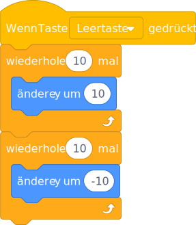
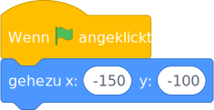
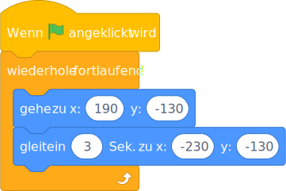

# Jump over the eggs

## A jumping chick

TODO: directly use the Svg! but i have to find a way to scale them to same size.


```
when [space v] key pressed
repeat (10)
    change x by (10)
end
repeat (10)
    change x by (-10)
end
```




```
when Flag clicked
go to x: (-150) y: (-100)
```




```
when Flag clicked
forever
  go to x: (190) y: (-130)
  glide (3) secs to x: (-230) y: (-130)
end
```




```
when Flag clicked
switch costume to (egg-a v)
wait until <touching (Chick v)
switch costume to (egg-b v)
stop [all v]
```


```
when Flag clicked
hide    
wait (1) secs
show
forever
  ...
end
```

