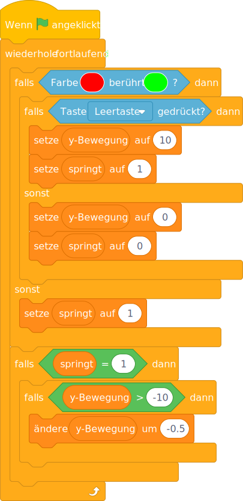

# jumping


```
when green flag clicked
set (y-speed) to [0]
set (jumping) to [0]
go to x: [0] y: [0]
forever
   change y by (y-speed)
```


```
when green flag clicked
forever
    if <color [#ff0000] is touching [#00ff00]?> then
        if <key [space v] pressed> then
            set (y-speed) to [10]
            set (jumping) to [1]
        else
            set (y-speed) to [0]
            set (jumping) to [0]
        end
    else
        set (jumping) to [1]
    end
    if <(jumping) = [1]> then
        if <(y-speed) > [-10]> then
            change (y-speed) by (-0.5)
```


```
Wenn die grüne Flagge angeklickt
setze (y-Bewegung) auf [0]
setze (springt) auf [0]
gehe zu x: [0] y: [0]
wiederhole fortlaufend 
  ändere y um (y-Bewegung)
end
```



```
Wenn die grüne Flagge angeklickt
wiederhole fortlaufend 
  falls <Farbe [#ff0000] berührt [#00ff00] ?> dann 
    falls <Taste [Leertaste v] gedrückt?> dann 
      setze (y-Bewegung) auf [10]
      setze (springt) auf [1]
    sonst
      setze (y-Bewegung) auf [0]
      setze (springt) auf [0]
    end
  sonst
    setze (springt) auf [1]
  end
  falls <(springt) = [1]> dann 
    falls <(y-Bewegung) > [-10]> dann 
      ändere (y-Bewegung) um (-0.5)
    end
  end
end
```

## Credits

- https://openclipart.org/download/230130/Cartoon-Frog-Profile.svg
