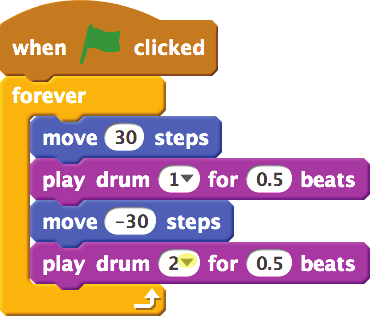
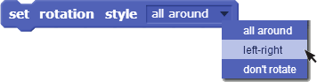
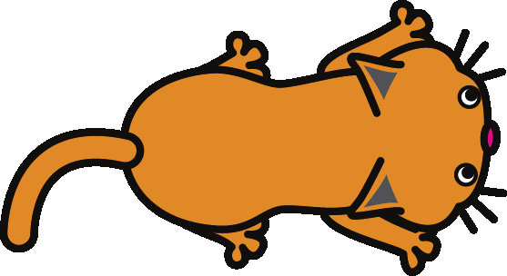
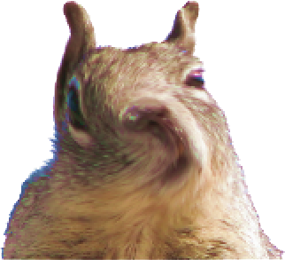

# Scratch Cards

(Some pictures are still embedded in the Scribus file and do not appear in this text version)

## 1. Change la couleur

Appuie sur une touche pour changer la couleur du lutin.

- Tu es prêt(e) ?
 - 
 - Choisis un lutin dans la bibliothèque.
 - Ou dessine en un nouveau.
 - Importe un lutin depuis un fichier.
- Essaie ce script
  - 
- Fais le !
  - Appuie sur la barre espace pour changer les couleurs
- Astuces
  - Tu peux choisir un effet différent dans le menu déroulant.
  - Ou inscris un nombre différent.
  - Ensuite presse la barre d’espace à nouveau.  
    Pour supprimer les effets, clique le signe Stop

## 2. Bouge en rythme

Danse au rythme du tambour.

- Tu es prêt(e) ?
  - 
  - Choisis un danseur ou une autre image.
- Essaie ce script !
  - 
  - 
  - Tape un nombre.
  - Clique pour choisir un son de tambour.
- Fais le !
  - Clique sur le drapeau vert pour commencer

## 3. Avec les flèches

Utilise les touches flèches pour déplacer le lutin.

03/mouse.png  

- Essaie ce script !
 - 
 - 
 - 
 - 
- Fais le !
  - Appuie sur les touches flèches pour déplacer !
- Astuces
  - 
  - Est ce que ton lutin est sans dessus dessous ?  
    Tu peux en modifier l'orientation.

## 4. Dis quelque chose

Que veux tu faire dire à ton lutin ?

- Tu es prêt(e) ?
    - 
    - Choisis un lutin.
    - Ecris un nom pour ton lutin.
- Essaie ce script
  - 
  - Ecris des mots.
- Fais le !
  - Clique sur le lutin pour commencer.

## 5. Glisser

Se déplacer doucement d’un point à un autre.

- Tu es prêt(e) ?
  - Choisis un costume.
  - Ou dessine un nouveau lutin.
- Essaie ce script
  - 
  - Essaie des nombres différents.
  - Position verticale.
  - Position horizontale.
  - Combien de temps ?
- Fais le !
  - Clique sur le drapeau vert pour commencer.
  - 
- Astuces
  - Voir la position du lutin:
  - Clique   pour voir x et y.
  - Les positions x y sur la scène.

## 6. Suis la souris

Suis le pointeur de la souris.

- 
- 

- Tu es prêt(e) ?
  - Choisis le chat ou un autre costume.
- Essaie ce script
  - 
- Fais le !
  - 
  - Clique sur le drapeau vert pour commencer.

## 7. Danse le Twist

Joue un son et fais danser le personnage.

- 
- 

- Tu es prêt(e) ?
  - Choisis une image ou un personnage qui danse.
  - Choisis ou enregistre un son.
    Choisis un son court !
- Essaie ce script
  - 
  - Choisis tournoyer à partir du menu déroulant.
- Fais le !
  - Appuie sur d pour commencer.

## 8. Tourbillon spirale

Déforme la photo en déplaçant la souris.

- 
- 
- 

- Tu es prêt(e) ?
  - Choisis l’écureuil ou une autre photo à déformer.
- Essaie ce script
  - 
  - Insère un bloc "Souris x" ici.
  - Choisis tournoyer dans le menu.
- Fais le !
  - 
  - Clique le drapeau vert pour commencer.
- Astuces
  - 
  - Remarque le changement des valeurs en déplaçant la souris.

## 9. Anime-le

Crée une simple animation.

- 09/penguin.png
- 09/penguin-2.png

- Tu es prêt(e) ?
  - 
  - Clique l'outil dupliquer (estampille).
  - Clique le lutin pour dupliquer le costume.
  - Utilise les outils de dessin pour changer l'allure du lutin.
- Essaie ce script
  - 
- Fais le !
  - 
  - Clique le drapeau vert pour commencer.

## 10. Deplacer et animer

Un personnage s’anime en se déplaçant.

- Tu es prêt(e) ?
  - Clique pour ouvrir la bibliothèque des lutins.
  - Choisis un lutin qui a deux ou plusieurs costumes.
- Essaie ce script
  - 
- Astuces
  - Est-ce que ton lutin a la tête à l’envers ?
  - Tu peux changer le mode de rotation.
  - Clique sur le .
  - rotation à 360°
  - gauche-droite
  - ne pivote pas

## 11. Un bouton surprise

Fait ton propre bouton.

- Tu es prêt(e) ?
  - Choisis un tambour dans la catégorie des objets.
  - Clique le  .
  - Tu peux changer le nom de ton lutin.
- Essaie ce script
  - 
  - Insère le bloc "nombre aléatoire".
- Fais le !
  - Clique pour voir et écouter le résultat.

## 12. Compte les points

Ajoute un compteur de score à ton jeu.

- 
- 

- Tu es prêt(e) ?
  - Dans la catégorie "Données" clique .
  - Donne à la variable le nom de “score” et clique sur OK.
  - Click the green flag to start.
- Essaie ce script
  - 
  - Utilise le menu déroulant pour choisir le lutin que tu poursuis.
- Fais le !
  - 
  - Clique le drapeau vert pour commencer.

## Notes

- Traduction adaptée de <http://scratchfr.free.fr/>
