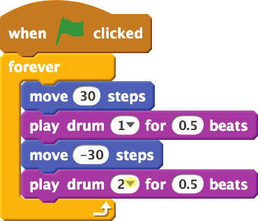
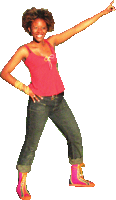
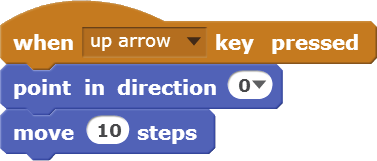
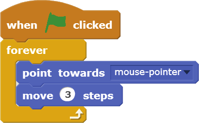
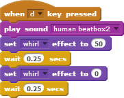
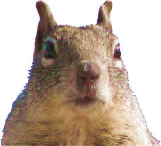
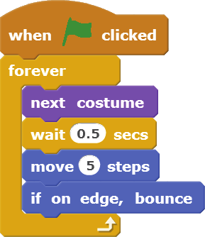
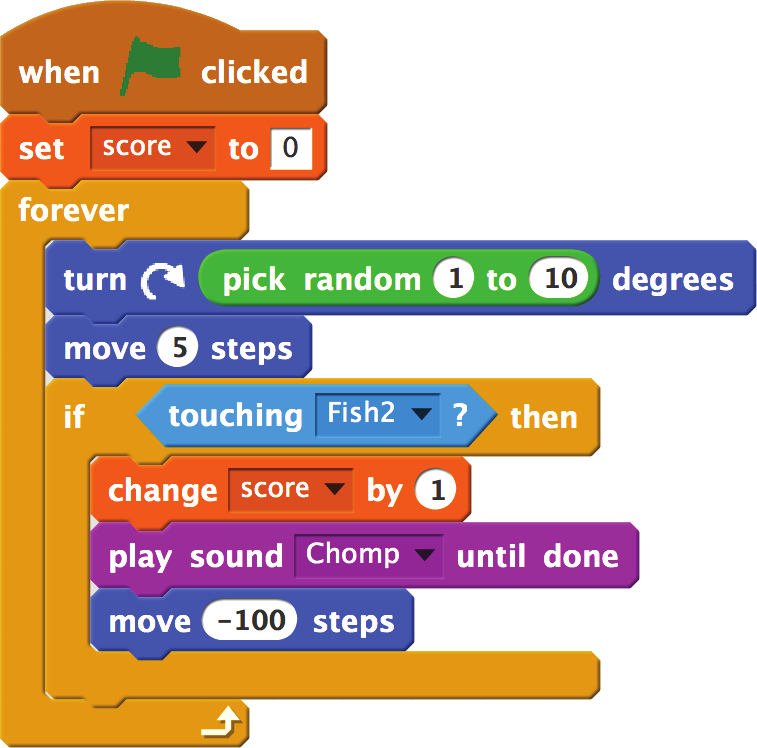

# Scratch Cards

(Some pictures are still embedded in the Scribus file and do not appear in this text version)

## 1. Cambia un colore

Premi un tasto per cambiare il colore di uno sprite.

- Preparati
 - 
 - Scegli uno sprite dalla biblioteca.
 - O disegna uno nuovo. 
- Prova questo codice 
  - 
- Fallo
  - Premi la barra spaziatrice per cambiare i colori.
- Consiglio extra
  - Puoi scegliere un effetto diverso dal menu:
  - O inserire un numero diverso. Dopodiché premi nuovamente la barra spaziatrice.
  - Per rimuovere gli effetti clicca       icona.

## 2. Muovi al ritmo 

Inizia a ballare al ritmo di tamburo.  

- Preparati
  - 
  - Scegli un ballerino o un' altra immagine.
- Prova questo codice
  - 
  - 
  - Inserisci questo numero.
  - Premi per scegliere il tono di tamburo.  
- Fallo
  - Premi la bandiera verde per iniziare

## 3. Muovi con i tasti 

Usa i tasti freccia per muovere il tuo sprite.  

03/mouse.png  

- Prova questo codice
 - 
 - 
 - 
 - 
- Fallo
  - Premi i tasti freccia per muovere!
- Consiglio extra
  - 
  - Il tuo sprite é all' inverso?  
    Puoi cambiare il suo stile di rotazione. 

## 4. Dì qualcosa

Cosa vuoi che dica il tuo sprite?

- Preparati
  - Scegli uno sprite
- Prova questo codice
  - 
  - Inserisci qualsiasi parola.
- Fallo
- Consiglio extra
  - Clicca sullo sprite  
    per iniziare.

## 5. Planare

Muovi in modo mellifluo da un punto all' altro.

- Preparati
  - Importa un costume
  - O disegna il tuo  
    proprio sprite.
- Prova questo codice
  - 
  - Prova numeri diversi. 
  - Per quanto
  - Posizione verticale
  - Posizione orizzontale
- Fallo
- Consiglio extra
  - 
  - Per vedere la posizione di uno sprite:
  - Clicca il,  
    vedi x e y
  - posizioni di x e y  
    sul palco

## 6. Segui il mouse

Segui il puntatore del mouse.

- 
- 

- Preparati
  - Scegli il gatto o un altro costume. 
- Prova questo codice
  - 
- Fallo
  - 
  - Premi la bandiera verde per iniziare 

## 7.  Danza Twist

Suona un brano musicale e torci il corpo. 

- 
- 

- Preparati
  - Scegli un' immagine di una persona pronta a danzare. 
  - Scegli o registra un brano musicale.
Sii breve!
- Prova questo codice
  - 
  - Scegli mulinello dal menu. 
- Fallo
  - Premi tasto per iniziare. 

## 8.  Mulinello interattivo

Gira una foto muovendo il mouse. 

- 
- 
- 

- Preparati
  - Scegli lo scoiattolo o un' altra immagine da roteare. 
- Prova questo codice
  - 
- Fallo
  - Inserisci qui il blocco "Mouse X".
  - Duplicazione, eventualmente collegato alla cornice
- Consiglio extra
  - 
  - 
  - Nota come cambiano i numeri quando muovi il mouse.

## 9.  Animare

Fai una semplice animazione.

- 09/penguin.png
- 09/penguin-2.png

- Preparati
  - 
  - Clicca l' istrumento per duplicare (stamper).
  - Usa gli strumenti da disegno per cambiare il nuovo costume.
- Prova questo codice
  - 
- Fallo
  - Clicca sullo sprite per duplicare il costume.

## 10.  Animazione movente

Anima un carattere mentre si muove.

- Preparati
  - Clicca per aprire la biblioteca di sprite.
  - Scegli uno sprite che possiede 2 o più costumi.
- Prova questo codice
  - 
- Consiglio extra
  - Il tuo sprite é all' inverso?
  - Puoi cambiare il suo stile di rotazione.
  - Clicca il .
  - tutto intorno
  - destra-sinistra
  - non roteare

## 11.  Bottone sorpresa

Crea il tuo proprio bottone.

- Preparati
  - Scegli un tamburo (dalla categorie degli oggetti).
  - Puoi modificare il nome del tuo sprite.
- Prova questo codice
  - 
  - Inserisci il blocco "numero a caso".
- Fallo
  - Clicca per vedere (e udire) quello che fa.

## 12.  Tenere il punteggio

Aggiungi un segnapunti al tuo gioco.

- 
- 

- Preparati
  - Sceglio "variabili"
  - Clicca
  - Inserisci "score" come nome di variabile e poi clicca su OK. 
  - Clicca la bandiera verde per iniziare.
- Prova questo codice
  - 
- Fallo
  - 
