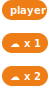
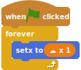
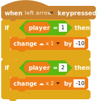
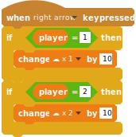
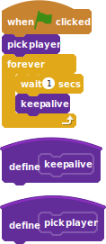
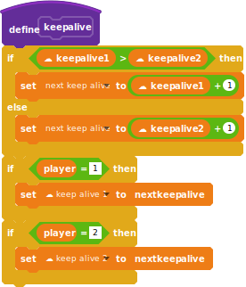
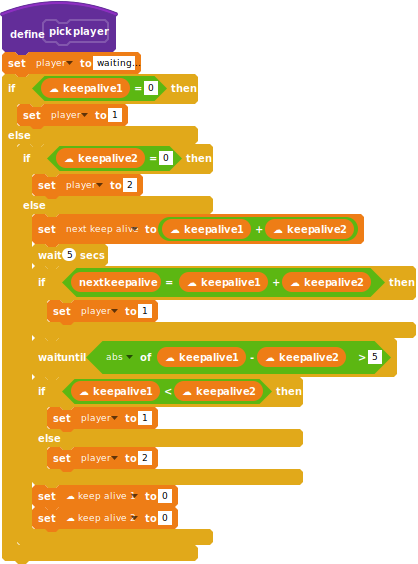
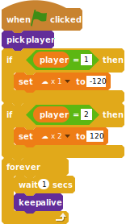

# Multiplayer games

In a multiplayer game two players can play the same on two different computers.

Our very simple program has two sprites as player one and two and they can move horizontally when the arrow keys are pressed.

A few remarks:

- For a multiplayer game you will need cloud variables, which you only can create if you have been registered to Scratch for some time.
- For testing purposes, you can run your game in two tabs or windows on the same computer.

## Move the sprites

Create two sprites, one for the player one and one for the player two.


TODO: take the svgs from the sb2

Create three variables:

- `player` will contain `1` or `2`, depending on wether you are the player one or player two.
- the `x 1` and `x 2` _cloud variables_ contain the horizontal position of each player.



```
(player)
(☁ x 1)
(☁ x 2)
```

Each sprite's position will be set to the current value of the matching `x` cloud variable.

In the `player 1` add the code:



```
when green flag clicked
forever
    set x to (☁ x 1)
```

And in the `player 2` :


```
when green flag clicked
forever
    set x to (☁ x 2)
```

Since we don't know _who_ is affected by the key presses, we put the code for detecting the arrow keys in the _Stage_ code:




```
when [left arrow v] key pressed
if <(player) = [1]> then
    change [☁ x 1 v] by [-10]
end
if <(player) = [2]> then
    change [☁ x 2 v] by [-10]
end
```



```
when [right arrow v] key pressed
if <(player) = [1]> then
    change [☁ x 1 v] by [10]
end
if <(player) = [2]> then
    change [☁ x 2 v] by [10]
end
```

You can use


```
set [player v] to [1]
```

to set the player to `1` or `2` and test that the left and right movements do work.

## Pick the player one and two

When the green flag is clicked, the game needs to know if you will be the player one or two. We will write a `keep alive` and `pick player` custom blocks to do it:




```
when green flag clicked
pick player
forever
    wait (1) secs
    keep alive
end

define keep alive

define pick player
```

Since this code is shared by both player we are putting it on the _Stage_.

We will now get into the hardest part of this tutorial.

The main idea is that each player _owns_ a sprite and regularly updates a counter – the `keep alive 1` and `keep alive 2` variables – to tell everybody that she is still active.

For each player, we need a `keep alive` cloud variable and a temporary variable for calculating the next keep alive value:


```
(☁ keep alive 1)
(☁ keep alive 2)
(next keep alive)
```

We could simply get each player to increment (_change by one_) her own counter. But, since we're checking for players by comparing the two counters, we want to avoid that one of both stays behind, just because the player has a slower computer.

The "keep alive" custom block:

- takes the maximal value between `keep alive 1` and `keep alive 2`,
- adds one to it, and
- and sets the own `keep alive` cloud variable.



```
define keep alive
if <(☁ keep alive 1) > (☁ keep alive 2)> then 
  set [next keep alive v] to ((☁ keep alive 1) + (1))
else 
  set [next keep alive v] to ((☁ keep alive 2) + (1))
end
if <(player) = [1]> then 
  set [☁ keep alive 1 v] to (next keep alive)
end
if <(player) = [2]> then 
  set [☁ keep alive 2 v] to (next keep alive)
end
```

We're now ready for defining the `pick player` custom block: the code that is run to find out if the new player can be the player one or the player two.

First, if one of the `keep alive` cloud variable is zero, that player slot is free and we can take it.

Otherwise, we have to wait for one of the two `keep alive` cloud variable to be more than five smaller than the other one. As soon as this happen, we can become the player with the lower value and, to make things nicer, we reset both `keep alive` cloud variables to `0`.



```
define pick player
set [player v] to [waiting...]
if <(☁ keep alive 1) = [0]> then 
  set [player v] to [1]
else 
  if <(☁ keep alive 2) = [0]> then 
    set [player v] to [2]
  else 
    set [next keep alive v] to ((☁ keep alive 1) + (☁ keep alive 2))
    wait (5) secs
    if <(next keep alive) = ((☁ keep alive 1) + (☁ keep alive 2))> then
        set [player v] to [1]
    else
        wait until <([abs v] of ((☁ keep alive 1) - (☁ keep alive 2))) > [5]>
        if <(☁ keep alive 1) < (☁ keep alive 2)> then 
          set [player v] to [1]
        else 
          set [player v] to [2]
        end
    end
  end
set [☁ keep alive 1 v] to [0]
set [☁ keep alive 2 v] to [0]
end
```

Finally, we can add some code to initialize the player's position when it's assigned:



```
when green flag clicked
pick player :: custom
if <(player) = [1]> then
   set [☁ x 1 v] to [-120]
end
if <(player) = [2]> then
   set [☁ x 2 v] to [120]
end
forever
    wait (1) secs
    keep alive :: custom
end
```

## Todo

- the keep alive should set the other keep alive to zero, if the distance grows above 5.
- we still would have to solve the situation where the second player disappears less than five seconds after the first one has disappeared.
