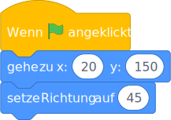
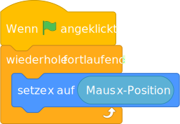
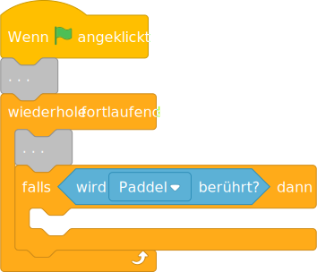
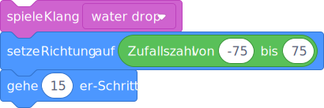
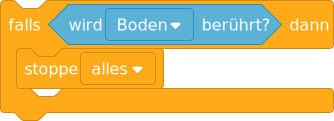

# Pong spielen

Bewege das Paddel, so dass der Ball nie den Boden berührt.


---

Pong ist eines der ältesten Computerspiele.

Ein Ball bewegt sich auf dem Bildschirm hin und her.

Bewege das Paddel, so dass der Ball nie den Boden berührt.

Wähle die entsprechenden Figuren aus der Bibliothek aus oder zeichne deine eigene Figuren.

---

Für das Spiel brauchst du:

- einen Ball,
- ein Paddel,
- einen Boden,
- und einen coolen Hintergrund.

---

Beim drücken der grüne Flagge soll der Ball zuerst zur Ausgangsposition gehen.



```
Wenn die grüne Flagge angeklickt
gehe zu x: (20) y: (150)
setze Richtung auf (45)
```

Dann soll der Ball anfangen sich hin und her zu bewegen:


```
wiederhole fortlaufend 
  gehe (15) er-Schritt
  pralle vom Rand ab
end
```

---

Klicke auf die grüne Flagge und der Ball soll anfangen sich hin und her zu bewegen.

---

Das Paddel soll unten am Bildschirm platziert werden und sich dann von links nach rechts bewegen.



```
Wenn die grüne Flagge angeklickt
wiederhole fortlaufend 
  setze x auf (Maus x-Position)
end
```

Das Paddel folgt den X-Koordinaten der Maus.

---

Der Ball soll prüfen, ob es das Paddel berührt.



```
Wenn die grüne Flagge angeklickt
. . .
wiederhole fortlaufend 
  . . .
  falls <wird [Paddel v] berührt?> dann
  end
end
```


```
gehe (10) er-Schritt
pralle vom Rand ab
```

Falls er es berührt, dann soll er zurückspringen:



```
spiele Klang [water drop v]
setze Richtung auf (Zufallszahl von (-75) bis (75))
gehe (15) er-Schritt
```

---

Und sobald der Ball den roten Boden berührt, wird alles gestoppt!



```
falls <wird [Boden v] berührt?> dann 
  stoppe [alles v]
end
```

---

- Punkte zählen.
- Paddel mit der Tastatur bewegen.
- Den Ball unterschiedlich zurückspringen lassen, je nach dem, ob er links, in der Mitte oder rechts das Paddel berührt (Paddel einfärben oder den Unterschied bei den X-Koordinaten berechnen).
