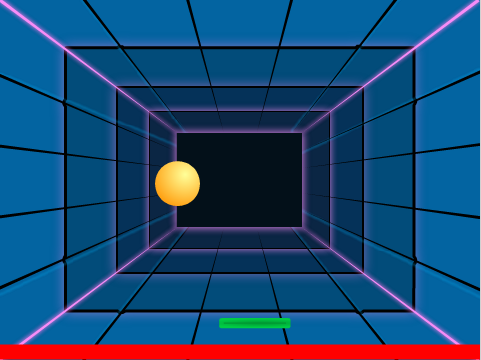
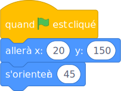

# Le jeu de Pong

Déplace la raquette  gauche et à droite et empêche que la balle touche le sol.



---

Pong est un des plus vieux jeux pour ordinateur.

La ball rébondit dans toutes les directions..

Déplace la raquette, pour faire répondir la balle et éviter qu'elle touche la bande rouge.

---

Pour ce jeux tu auras besoin de:

- une balle
- une raquette
- un "floor"
- un joli arrière-plan

Choisi les lutins dans la bibliothèque ou dessine-les.

---

Lors du clic sur le drapeau vert, la balle va à sa position initiale:



```
quand le drapeau vert pressé
aller à x: (20) y: (150)
s'orienter à (45)
```


```
répéter indéfiniment 
  avancer de (15)
  rebondir si le bord est atteint
end
```


```
quand le drapeau vert pressé
répéter indéfiniment 
  donner la valeur (souris x) à x
end
```


```
quand le drapeau vert pressé
. . .
répéter indéfiniment 
  . . .
  si <[raquettte v] touché?> alors
  end
end
```


```
avancer de (10)
rebondir si le bord est atteint
```


```
jouer le son [water drop v]
s'orienter à (nombre aléatoire entre (-75) et (75))
avancer de (15)
```


```
si <[sol v] touché?> alors 
  stop [tout v]
end
```

```
```

```
```

# Todo

- un clic?
