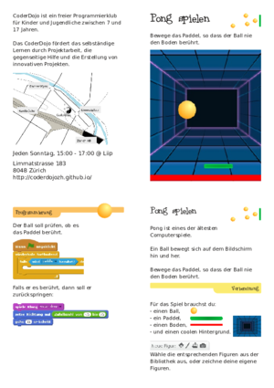
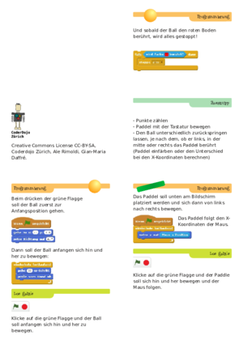
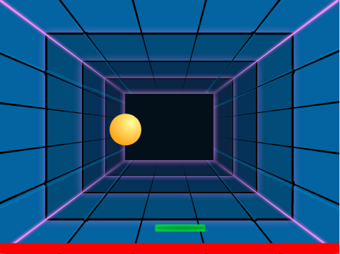
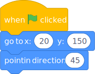
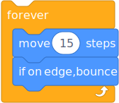
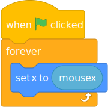
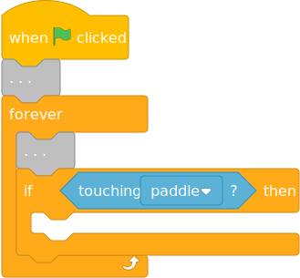
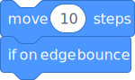
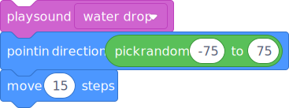
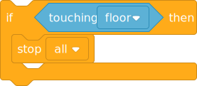

# Playing Pong


  

Download this PDF and print it both sides witout any resizing on A4 paper:  

- [A4 pdf Deutsch](https://github.com/CoderDojoZH/resources/raw/master/cards-scratch/pong/pong-deCH-a4.pdf)
- [A4 pdf English](https://github.com/CoderDojoZH/resources/raw/master/cards-scratch/pong/pong-en-a4.pdf)

## Content

Move the paddle left and right. Prevent the ball from touching the floor.



---

Pong is one of the oldest computer games.

The ball moves on the screen in all directions.

Move the paddle, so that the ball does not touch the floor.

---

To create the game, you will need:

- a ball
- a paddle
- a floor
- and a cool background

Pick the sprites from the library or draw them yourself.

---

After clicking on the green flag, the ball should go to its starting position:



```
when green flag clicked
go to x: (20) y:(150)
point in direction (45)
```

Then, the following code will make the ball move and bounce.



```
forever
    move (15) steps
    if on edge, bounce
```


---


Click on the green flag and the ball should start moving in all directions.

---

Place the paddle at the bottom of the screen and add the code to move it left and right.



```
when green flag clicked
forever
    set x to(mouse x)
```

The paddle follows the x coordinates of the mouse.

---


Click on the green flag and, when you move your mouse, the paddle should start moving left and right.

---

The ball should check if it touches the paddle:



```
When Flag clicked
...
forever
    ...
    if <touching [paddle v]?> then
    end
end
```



```
move (10) steps
if on edge bounce
```

When it touches the paddle, it should bounce back.



```
play sound [water drop v]
point in direction(pick random (-75) to (75)
move (15) steps
```

---

When it touches the paddle, it should bounce back.

As soon as the ball touches the red floor, the game should stop.  
Add this to the Ball's forever loop:



```
if <touching [floor v]> then
    stop [all v]
```

- Count the points.
- Use the keyboard to control the paddle.
- Set the ball bounce direction depending on the side of the paddle that has been touched - left, center or right (you can use colors to do it or calculate the x coordinate).

## Notes

- for the PNG preview of the A4 version:  
  `convert -background white -alpha remove -resize 300x pong-a4-deCH.pdf pong-a4-deCH.png`  
  to get `pong-a4-deCH-1.png` to `pong-a4-deCH-3.png`
  `convert -background white -alpha remove -resize 300x pong-a4-en.pdf pong-a4-en.png`
