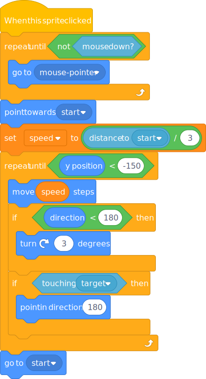

# Pull and launch

## Code


```
When Flag clicked
go to (start v)
```



```
When this sprite clicked
repeat until <not <mouse down?>>
    go to (mouse-pointer v)
end
point towards (start v)
set [speed v] to ((distance to (start v) / 3))
repeat until <touching (target v)>
  move (speed) steps
  if <(direction) < (180)> then
    turn cw (3) degrees
  end
end
```

## Notes

### dx and dy

the right way to set the speed seems to be:

```
set [v v] to ((distance to (start v)) / (3)
set [dx v] to ([v v] * ([sin v] of (direction))
set [dy v] to ([v v] * ([cos v] of (direction))
repeat until <touching (target v)>
  change x by (dx)
  change y by (dy)
  change (dy) by (-0.1)
end
```

## Drawing a pull string

It should be easy to use the pen to draw a pull string.

## Credits

Basketball hoop: https://openclipart.org/detail/312211/basketball-hoop
