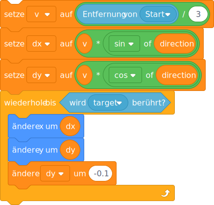

# Throwing and gravity


```
set [v v] to ((distance to (start v)) / (3)
set [dx v] to ((v) * ([sin v] of (direction :: variables))
set [dy v] to ((v) * ([cos v] of (direction :: variables))
repeat until <touching (target v)>
  change x by (dx)
  change y by (dy)
  change [dy v] by (-0.1)
end
```



```
setze [v v] auf ((Entfernung von (Start v)) / (3))
setze [dx v] auf ((v) * ([sin v] of (Richtung :: variables)))
setze [dy v] auf ((v) * ([cos v] of (Richtung :: variables)))
wiederhole bis <wird (Ziel v) berührt?> 
  ändere x um (dx)
  ändere y um (dy)
  ändere [dy v] um (-0.1)
end
```
