# Scratch Cards

Scratch Cards are provided by the Lifelong Kindergarten Group at the MIT Media Lab at <https://scratch.mit.edu/help/cards/>.

This remix gives you cards in A6 format that can be easily and cheaply be printed in Europe and most parts of the World.

The images on the cards being already "funny" enough, we also refrained from adding the colored backgrounds and the extra decorations.

## Printing on A4

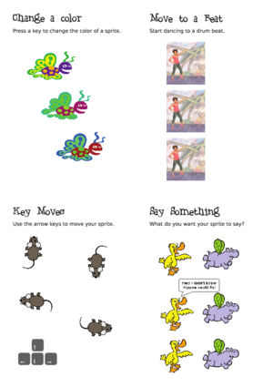
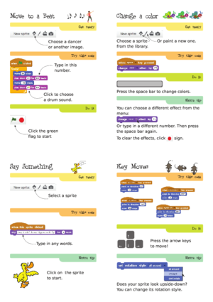  

Download this PDF and print it both sides witout any resizing on A4 paper:  
[A4 pdf](cards-a4.pdf)

## Printing on A5

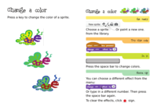
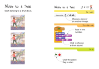
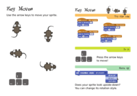  
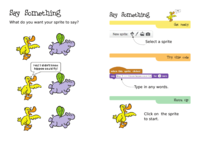
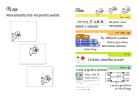
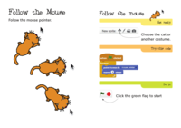  
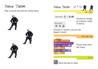
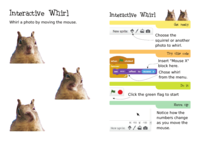
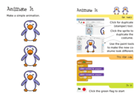  
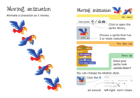
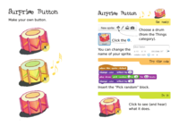
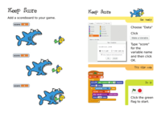

Download this PDF and print it both sides witout any resizing on A6 paper:  
[A6 pdf](cards-a6.pdf)

## The layout file

The cards have been created with Scribus 1.5svn (currently the development version):

- [cards-a6.sla](cards-a6.sla)

## Preparing the PDF and PNG files

### Producing the A4 PDF and its PNG preview

- producing the PDF from Scribus with the following custom range:  
  `1,3,5,7,4,2,8,6,9,11,13,15,12,10,16,14,17,19,21,23,20,18,24,22`
- use `pdfnup` (from the pdfjam package) to put 4 A6 pages on each A4 side:  
  `pdfnup --nup 2x2 --frame false --no-landscape cards-a6-reordered.pdf --outfile cards-a4.pdf`
- for the PNG preview of the A4 version:  
  `convert -background white -alpha remove -resize 300x cards-a4.pdf cards-a4.png`  
  to get `cards-a4-1.png` to `cards-a4-3.png`

### Producing the single cards preview for the website

- for the PNG preview of all the cards:  
  `pdfnup --nup 2x1 --frame false cards-a6.pdf --outfile cards-a5.pdf`  
  `convert -background white -alpha remove -resize 200x cards-a5.pdf cards-a5.png`

## Todo

- fix typos 
- translate to german (both the text and the screenshots; eventually also french and italian) 
- create new cards
  - pong,
  - goalkeeper with webcam,
  - ...
- we can also create A5 cards folded in two for more complex exemples.
- ...? 
