# Scratch Cards

(Some pictures are still embedded in the Scribus file and do not appear in this text version)

## 1. Farbe wechseln

Drücke eine Taste, um die Farbe einer Figur zu ändern.

- Vorbereitung
 - 
 - Wähle eine Figur aus der Bibliothek.
 - Oder male ein neues.
- Probier den Code
  - 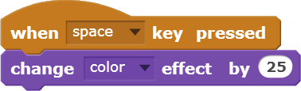
- Mach es
  - Drücke die Leertaste um die Farben zu wechseln.
- Extra Tipp
  - Du kannst verschiedene Effekte vom Menü wählen:
  - Oder tippe eine andere Nummer. Danach drücke nochmals die Leertaste.
  - Um die Effekte zu löschen klicke auf       Symbol.

## 2. Bewege dich im Takt

Tanze zum Takt eines Schlagzeugs.

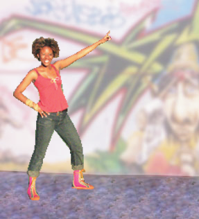

- Vorbereitung
  - 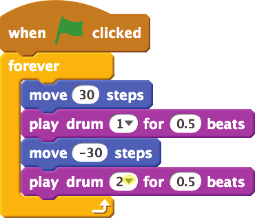
  - Wähle einen Tänzer oder ein anderes Bild.
- Probier den Code
  - 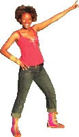
  - 
  - Tippe diese Nummer.
  - Klicke um ein Schlagzeugton zu wählen.
- Mach es
  - Zum Starten klicke auf die grüne Flagge

## 3. Bewegung mittels Tasten

Benutze die Pfeiltasten um deine Figur zu bewegen.

03/mouse.png  

- Probier den Code
 - 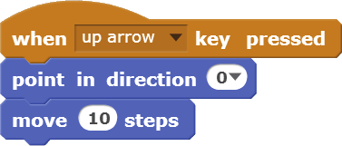
 - 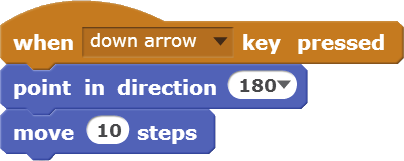
 - 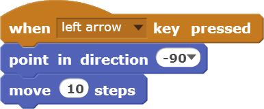
 - 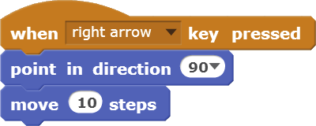
- Mach es
  - Drücke die Pfeiltasten für die Bewegung!
- Extra Tipp
  - 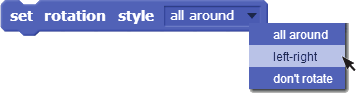
  - Liegt deine Figur verkehrt herum?
    Du kannst sein Drehungs-Stil ändern.

## 4. Sag etwas

Was willst du dass deine Figur sagt?

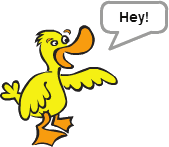

- Vorbereitung
  - Wähle eine Figur
- Probier den Code
  - 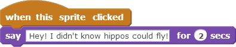
  - Tippe irgendwelche Wörter.
- Mach es
- Extra Tipp
  - Klicke auf das Objekt um zu starten.

## 5. Gleiten

Bewege dich sanft von einem Punkt zum anderen.

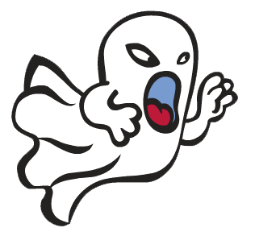

- Vorbereitung
  - Importiere ein Kostüm
  - Oder male dein  
    eigenes Objekt.
- Probier den Code
  - 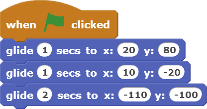
  - Versuch unterschiedliche Zahlen.
  - Wie lange
  - Senkrechte Position
  - Waagrechte Position
- Mach es
- Extra Tipp
  - 
  - Um die Position eines Objektes zu sehen:
  - Klicke auf,  
    schau auf x und y
  - x und y legt die Position  
    auf der Bühne fest

## 6. Folge der Maus

Folge dem Mauszeiger.

- 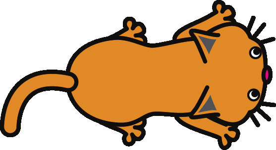
- 

- Vorbereitung
  - Wähle die Katze oder ein anderes Objekt.
- Probier den Code
  - 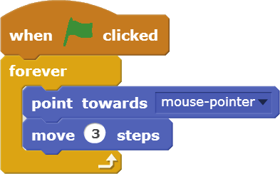
- Mach es
  - 
  - Zum Starten klicke auf die grüne Flagge

## 7.  Tanz den Twist

Spiele ein Musikstück und twiste mit dem Körper.

- 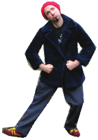
- 

- Vorbereitung
  - Wähle ein Bild einer Person, die zum Tanzen bereit ist.
  - Wähle oder nimm ein Musikstück auf.
Fass dich kurz!
- Probier den Code
  - 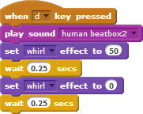
  - Wähle Wirbel vom Menü.
- Mach es
  - Zum Starten drücke irgend eine Taste.

## 8.  Interaktiver Wirbel

Wirble ein Photo mittels Mausbewegung.

- 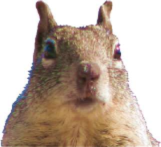
- 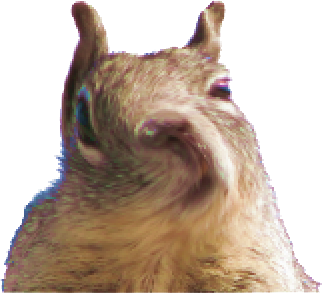
- 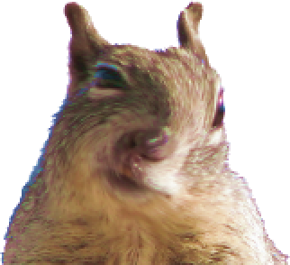

- Vorbereitung
  - Wähle das Eichhörnchen oder sonst ein Photo zum herumwirbeln.
- Probier den Code
  - 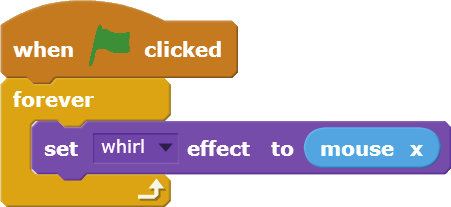
- Mach es
  - Füge den "Mouse X" Block hier hinzu.
  - Verdoppelung, vielleicht rahmengebunden
- Extra Tipp
  - 
  - 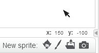
  - Beachte wie die Zahlen sich ändern während du die Maus bewegst.

## 9.  Bewege es

Mache eine simple Bewegung.

- 09/penguin.png
- 09/penguin-2.png

- Vorbereitung
  - 
  - Klicke auf dem Stempel (stamper) um Kopien zu erstellen
  - Verwende das Werkzeug im Malprogramm, damit das neue Kostüm anderst aussieht.
- Probier den Code
  - 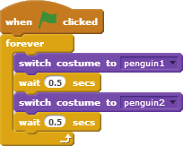
- Mach es
  - Klicke auf das Objekt um das Kostüm zu verdoppeln.

## 10.  Bewegungsanimation

Animiere eine Figur während sie sich bewegt.

- Vorbereitung
  - Klicke um die Objekt-Bibliothek zu öffnen.
  - Wähle eine Figur, die zwei oder mehr Kostüme hat.
- Probier den Code
  - 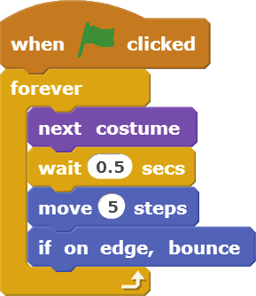
- Extra Tipp
  - Steht deine Figur verkehrt herum?
  - Du kannst seinen Drehstil ändern.
  - Klicke den .
  - ganz herum
  - links-rechts
  - dreh dich nicht

## 11.  Überraschungsknopf

Erstelle deinen eigenen Knopf.

- Vorbereitung
  - Wähle ein Schlagzeuge (aus der Dinge Kategorie).
  - Du kannst den Namen des Objektes ändern.
- Probier den Code
  - 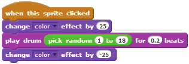
  - Füge den "Pick random" Block.
- Mach es
  - Klicke um zu sehen (und hören) was es macht.

## 12. Punkte zählen

Füge deinem Spiel eine Anzeigetafel hinzu.

- 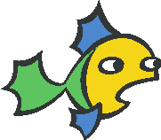
- 

- Vorbereitung
  - Wähle "Data"
  - Klicke
  - Tippe "score" als Variablennamen und klicke dann auf OK.
  - Zum Starten klicke auf die gründe Flagge.
- Probier den Code
  - 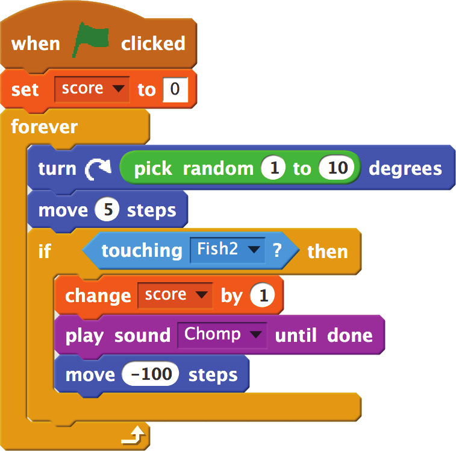
- Mach es
  - 
