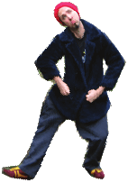

# Scratch Cards

(Some pictures are still embedded in the Scribus file and do not appear in this text version)

## 1. Farbe ändern

Drücke eine Taste, um die Farbe einer Figur zu ändern.

- Vorbereitung
 - 
 - Wähle eine Figur  
   aus der Bibliothek.
 - Oder male eine neue.
- Probier den Code
  - 
- Los geht's
  - Drücke die Leertaste um die Farben zu wechseln.
- Zusatztipp
  - Du kannst verschiedene Effekte vom Menü wählen:
  - Oder tippe eine andere Zahl. Nochmals die Leertaste drücken.
  - Ein Klick auf      löscht die Effekten.

## 2. Bewege dich im Takt

Tanze zum Takt des Schlagzeugs.

- Vorbereitung
  - 
  - Wähle einen Tänzer oder ein anderes Bild.
- Probier den Code
  - 
  - 
  - Tippe diese Zahl.
  - Klicke hier um einen Schlagzeugton auszuwählen.
- Los geht's
  - Klicke zum Starten auf die grüne Flagge.

## 3. Bewegen mit Tasten

Benutze die Pfeiltasten um deine Figur zu bewegen.

03/mouse.png  

- Probier den Code
 - 
 - 
 - 
 - 
- Los geht's
  - Drücke die Pfeiltasten für die Bewegung!
- Zusatztipp
  - 
  - Liegt deine Figur verkehrt herum?
    Du kannst ihr Drehungs-Stil ändern.

## 4. Sag etwas

Was willst du, dass deine Figur sagt?

- Hallo! Ich wusste gar nicht,  
  dass Nilpferde fliegen können!

- Vorbereitung
  - Wähle eine Figur.
- Probier den Code
  - 
  - Tippe irgendwelche Wörter.
- Los geht's
- Zusatztipp
  - Klicke zum Starten auf die Figur.

## 5. Gleiten

Bewege dich sanft von einem Punkt zum anderen.

- Vorbereitung
  - Importiere ein Kostüm
  - Oder male deine  
    eigene Figur.
- Probier den Code
  - 
  - Probier andere Zahlen.
  - Wie lange
  - Senkrechte Position
  - Waagrechte Position
- Los geht's
  - Klicke zum Starten auf die grüne Flagge.
- Zusatztipp
  - 
  - Wo genau ist die Figur?
  - Klicke auf ,
    schau auf x, y
  - x und y Positionen auf der Bühne

## 6. Folge der Maus

Folge dem Mauszeiger.

- 
- 

- Vorbereitung
  - Wähle die Katze oder eine andere Figur.
- Probier den Code
  - 
- Los geht's
  - 
  - Klicke zum Starten auf die grüne Flagge

## 7.  Tanz den Twist

Spiele ein Musikstück und twiste mit dem Körper.

- 
- 

- Vorbereitung
  - Wähle ein Bild einer Person, die zum Tanzen bereit ist.
  - Wähle oder nimm ein Musikstück auf.  
    Fass dich kurz!
- Probier den Code
  - 
  - Wähle Wirbel aus dem Menü.
- Los geht's
  - Drücke diese Taste zum Starten.

## 8.  Interaktiver Wirbel

Wirble ein Photo per Mausbewegung.

- 
- 
- 

- Vorbereitung
  - Wähle das Eichhörnchen oder sonst ein Photo zum herumwirbeln.
- Probier den Code
  - 
  - Füge den "Maux x-Position" Block hier ein.
  - Wähle "Wirbel" aus dem Menü.
- Los geht's
  - Klicke zum Starten auf die grüne Flagge.
- Zusatztipp
  - 
  - 
  - Beobachte, wie sich die Zahlen,  ändern während du die Maus bewegst.

## 9.  Animation

Erstelle eine einfache Animation.

- 09/penguin.png
- 09/penguin-2.png

- Vorbereitung
  - 
  - Klicke auf dem Stempel um zu kopieren.
  - Mit den Malwerkzeuge bearbeite das neue Kostüm.
- Probier den Code
  - 
- Los geht's
  - Klicke auf die Figur um das Kostüm zu verdoppeln.

## 10. Animierte Bewegung

Animiere eine Figur während sie sich bewegt.

- Vorbereitung
  - Die Figur-Bibliothek öffnen.
  - Wähle eine Figur mit zwei oder mehr Kostüme.
- Probier den Code
  - 
- Zusatztipp
  - Steht deine Figur verkehrt herum?
  - Du kannst seinen Drehstil ändern.
  - Klicke den .
  - rundherum 
  - links-rechts
  - keine drehung

## 11.  Überraschungsknopf

Erstelle deinen eigenen Knopf.

- Vorbereitung
  - Wähle ein Schlagzeuge (aus der Dinge Kategorie).
  - Du kannst den Namen der Figure ändern.
- Probier den Code
  - 
  - Füge den "Zufallszahl" Block.
- Los geht's
  - Klicke um zu sehen (und hören) was es macht.

## 12. Punkte zählen

Füge deinem Spiel einen Zähler hinzu.

- 
- 

- Vorbereitung
  - Wähle "Data"
  - Klicke
  - Tippe "score" als Variablennamen und klicke dann auf OK.
  - Klicke zum Starten auf die gründe Flagge.
- Probier den Code
  - 
- Los geht's
  - 
