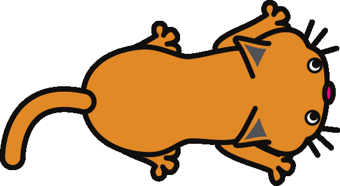

# Scratch Cards

(Some pictures are still embedded in the Scribus file and do not appear in this text version)

## 1. Change a color

Press a key to change the color of a sprite.

- Get ready
 - 
 - Choose a sprite from the library.
 - Or paint a new one.
- Try this code
  - 
- Do it
  - Press the space bar to change colors.
- Extra tip
  - You can choose a different effect from the menu:
  - Or type in a different number. Then press the space bar again.
  - To clear the effects, click       sign.

## 2. Move to a Beat

Start dancing to a drum beat.

- Get ready
  - 
  - Choose a dancer or another image.
- Try this code
  - 
  - 
  - Type in this number.
  - Click to choose a drum sound.
- Do it
  - Click the green flag to start

## 3. Key Moves

Use the arrow keys to move your sprite.

03/mouse.png  

- Try this code
 - 
 - 
 - 
 - 
- Do it
  - Press the arrow keys to move!
- Extra tip
  - 
  - Does your sprite look upside-down?  
    You can change its rotation style.

## 4. Say Something

What do you want your sprite to say?

- Get ready
  - Select a sprite
- Try this code
  - 
  - Type in any words.
- Do it
- Extra tip
  - Click on  the sprite  
    to start.

## 5. Glide

Move smoothly from one point to another.

- Get ready
  - Import a costume
  - Or paint your  
    own sprite.
- Try this code
  - 
  - Try different numbers.
  - How long
  - Vertical position
  - Horizontal position
- Do it
- Extra tip
  - 
  - To see a sprite's position:
  - Click the,  
    see x and y
  - x and y positions  
    on the Stage

## 6. Follow the Mouse

Follow the mouse pointer.

- 
- 

- Get ready
  - Choose the cat or another costume.
- Try this code
  - 
- Do it
  - 
  - Click the green flag to start

<!--

Page 13

Text274: Dance Twist

Text275: Play a sound clip and do a body twist.

Image278: /home/ale/docs/src/dojo-resources/cards/07/dancer-01.png
Image279: /home/ale/docs/src/dojo-resources/cards/07/dancer-02.png
Image280: /home/ale/docs/src/dojo-resources/cards/07/dancer-01.png

Page 14

Text276: Duplication, perhaps linked-to frame

Text277: Duplication, perhaps linked-to frame

Text282: Choose an image of a person ready to dance.

Copy of  image3504 (5): /tmp/scribus_temp_e21575.png
Text284: Duplication, perhaps linked-to frame

Image293: /home/ale/docs/src/dojo-resources/cards/07/dancer-01.png
Image294: /home/ale/docs/src/dojo-resources/cards/07/dancer-02.png
 image9041: /home/ale/docs/src/dojo-resources/cards/07/code.png
Text300: Chose whirl from the menu.

Text285: Duplication, perhaps linked-to frame

Text321: Press the key to start.

Text322: Choose or record a sound clip.
Keept it short!

Page 15

Text323: Interactive Whirl

Text324: Whirl a photo by moving the mouse.

Image346: /home/ale/docs/src/dojo-resources/cards/08/squirrel-02.png
Image347: /home/ale/docs/src/dojo-resources/cards/08/squirrel-01.png
Image348: /home/ale/docs/src/dojo-resources/cards/08/squirrel.png

Page 16

Image349: /home/ale/docs/src/dojo-resources/cards/08/squirrel-01.png
Image345: /home/ale/docs/src/dojo-resources/cards/08/squirrel.png
 image11736: /home/ale/docs/src/dojo-resources/cards/08/code.png
Text325: Duplication, perhaps linked-to frame

Text326: Duplication, perhaps linked-to frame

Copy of  image3504 (6): /tmp/scribus_temp_f21575.png
Text329: Choose the squirrel or another photo to whirl.

Text330: Duplication, perhaps linked-to frame

Text331: Duplication, perhaps linked-to frame

Image332: /home/ale/docs/src/dojo-resources/cards/02/img-000.png
Text334: Duplication, perhaps linked-to frame

 image11726: /home/ale/docs/src/dojo-resources/cards/08/desktop.png
Text335: Duplication, perhaps linked-to frame

Text338: Notice how the numbers change as you move the mouse.

Text341: Insert "Mouse X" block here.

Text342: Duplication, perhaps linked-to frame

Page 17

Text350: Animate It

Text351: Make a simple animation.

Image373: /home/ale/docs/src/dojo-resources/cards/09/penguin.png
Image375: /home/ale/docs/src/dojo-resources/cards/09/penguin-2.png
Image376: /home/ale/docs/src/dojo-resources/cards/09/penguin.png

Page 18

Text352: Duplication, perhaps linked-to frame

Text353: Duplication, perhaps linked-to frame

Text354: Duplication, perhaps linked-to frame

Text355: Duplication, perhaps linked-to frame

Image357: /home/ale/docs/src/dojo-resources/cards/02/img-000.png
Text358: Duplication, perhaps linked-to frame

 image20935: /home/ale/docs/src/dojo-resources/cards/09/code.png
Text370: Click for duplicate (stamper) tool.

Text371: Click the sprite to duplicate the costume.

Text372: Use the paint tools to make the new co-stume look different.

Image377: /home/ale/docs/src/dojo-resources/cards/09/penguin.png
Image378: /home/ale/docs/src/dojo-resources/cards/09/penguin-2.png

Page 19

Text382: Moving animation

Text383: Animate a character as it moves.

Page 20

Copy of  image23828: /tmp/scribus_temp_U21575.png
Copy of  image23820: /tmp/scribus_temp_Z21575.png
 image23098: /home/ale/docs/src/dojo-resources/cards/10/code.png
Text385: Duplication, perhaps linked-to frame

Text405: Duplication, perhaps linked-to frame

Text406: Duplication, perhaps linked-to frame

Copy of  image3504 (7): /tmp/scribus_temp_R21575.png
Text409: Click to open the sprite library.

Text410: Choose a sprite that has 2 or more costumes.

Text426: Click the .

Text427: Does your sprite look upside-down?

Text428: You can change its rotation style.

Text429: all around

Text430: left-right

Text431: don't rotate

Text384: Duplication, perhaps linked-to frame

Page 21

Text436: Surprise Button

Text437: Make your own button.

 image26247: /tmp/scribus_temp_svg_s21575.png
 image26259: /tmp/scribus_temp_svg_W21575.png
 image26271: /tmp/scribus_temp_svg_Q21575.png

Page 22

Copy of  image26247 (2): /tmp/scribus_temp_a21575.png
 image25451: /home/ale/docs/src/dojo-resources/cards/11/code.png
Copy of  image26247: /tmp/scribus_temp_S21575.png
Text438: Duplication, perhaps linked-to frame

Text439: Duplication, perhaps linked-to frame

Copy of  image3504 (8): /tmp/scribus_temp_t21575.png
Text487: Choose a drum (from the Things category).

Text494: Duplication, perhaps linked-to frame

Text498: You can change the name of your sprite.

Text500: Duplication, perhaps linked-to frame

Text501: Duplication, perhaps linked-to frame

Text505: Insert the "Pick random" block.

Text506: Click to see (and hear) what it does.

Page 23

Text511: Keep Score

Text512: Add a scoreboard to your game.

 image29181: /tmp/scribus_temp_svg_ea1575.png
 image29189: /home/ale/docs/src/dojo-resources/cards/12/fish.png
 image29197: /home/ale/docs/src/dojo-resources/cards/12/shark.png
 image29205: /home/ale/docs/src/dojo-resources/cards/12/fish.png
 image29221: /home/ale/docs/src/dojo-resources/cards/12/shark.png
 image29237: /tmp/scribus_temp_svg_B21575.png
 image29253: /tmp/scribus_temp_svg_F21575.png
 image29261: /home/ale/docs/src/dojo-resources/cards/12/fish.png
 image29277: /home/ale/docs/src/dojo-resources/cards/12/shark.png

Page 24

 image28535: /home/ale/docs/src/dojo-resources/cards/12/code.png
Text513: Duplication, perhaps linked-to frame

Text514: Duplication, perhaps linked-to frame

Text578: Choose "Data"

Text579: Click

Text583: Type "score" for the variable name and then click OK.

Text584: Duplication, perhaps linked-to frame

Text588: Duplication, perhaps linked-to frame

Image589: /home/ale/docs/src/dojo-resources/cards/02/img-000.png
Text590: Click the green flag to start.

-->
