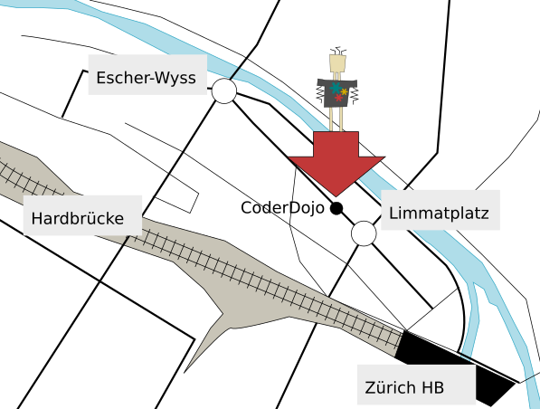

[Download the draft Pdf](flyer-kids.pdf)

~~~
|          |         |          |
| Innen-   | Rück-   | Titel-   |
| seite    | seite   | seite    |
|          |         |          |
|          |         |          |
|          |         |          |

|          |         |          |
| Inhalt   | Inhalt  | Inhalt   |
|    1     |    2    |    3     |
|          |         |          |
|          |         |          |
|          |         |          |
~~~

## Titelseite

Für Ninjas  
im Alter von 7 bis 17

Sonntags
15:00 – 17:00  

## Rückseite

CoderDojo ist ein durch Freiwillige geführtes Netzwerk von Clubs, das kostenlose Computer Progammierkurse für Kinder im Alter von 7-17 anbietet.

CoderDojo legt grossen Wert auf selbstmotiviertes Lernen mittels Projektarbeit, Peer-to-Peer-Mentoring und die Schaffung von innovativen Projekten.

Es gibt über 450 Coderdojos in 45 Ländern, die den Kindern die Programmierung am Computer vermitteln.

Sonntag, 15:00 - 17:00 @ Liip

Limmatstrasse 183  
8048 Zürich  
http://coderdojozh.github.io/

## Innenklappe

### Das CoderDojo Zürich

Das CoderDojo Zürich ist eine mehrsprachige Gruppe (DE, EN, IT, PL, FR).  
Ihr werdet weitaus mehr an diesen Treffs lernen, wenn ihr regelmässig teilnimmt – was natürlich nicht jede Woche sein muss. Bringt den Laptop mit. Wir können aber auch Computer auf Anfrage bereitstellen. Es ist keine ständige Aufsicht durch die Eltern notwendig. Die Eltern können in der Zwischenzeit in unserer kleinen Lounge entspannen.

### Aktivitäten

Ninjas, die nie Computer Code geschrieben haben, werden mit Lightbot  in die Grundlagen der Programmierung eingeführt.  
Unsere Hauptplattform ist Scratch, eine leistungsstarke, einfache Programmierumgebung, die Code in vordefinierten Blöcken verwendet. Zusätzlich bieten wir auch Workshops mit MaKey MaKey, Thymio und vieles mehr an.

### Kontakt

Sie können uns über das Twitter Kanal kontaktieren: @CoderDojoZH

Falls Ihr teilnehmen möchtet, dann registriert Euch bitte auf unserer Meetup Seite:
http://meetup.com/Coder-Dojo-Zurich

Weitere Infos sind auf unsere Webseite:
http://coderdojozh.github.io/

## Inhalt 1

### Lightbot

Lightbot ist ein Lernspiel, das die Kinder in mehrere Grundsätze der Programmierung - Sequenz, Bedingungen und Schleifen - führt. Die Kids nutzen ihre Fähigkeiten in der Problemlösung, um die Rätsel zu vervollständigen.

### Thymio

Thymio II ist ein kostengünstiger Bildungsroboter, der über eine grosse Anzahl an Sensoren und Antriebselementen verfügt. Es ermöglicht Interaktionen mittels Licht und Berührung, mit grafischer und textlicher Programmierung.

## Inhalt 2

### Scratch

Scratch ist eine freie Bildungs-Programmiersprache, die am Massachusetts Institute of Technology (MIT) entwickelt wurde und über fünf Millionen registrierte Nutzer hat.

Scratch soll Spass machen, pädagogisch wertvoll und einfach erlernbar sein. Es verfügt über eine Werkzeugpalette zum Erstellen von interaktiven Geschichten, Spiele, Kunst, Simulationen... Scratch hat eigene Zeichnen und Sound Editoren sowie viele vorgefertigten Beispielen von denen man schnell und einfach lernt.

Scratch vereinfacht die Programmierung mittels Puzzle Blöcken, die zu Code-Strukturen kombiniert werden.

Es ist ein mächtiges und einfaches Werkzeug, mit dem schnell etwas ausprobiert und sofort das Resultat sieht.

## Inhalt 3

### Makey Makey

Makey Makey funktioniert wie eine Tastatur, sieht aber nicht wie eine aus: Es ist eine bunte Krake mit vielen Kabeln und Krokodilklemmen und verbindet Alltagsgegenstände mit euren Spielen - oder mit euren Scratch Programmen. Es funktioniert mit Bananen, Knetteig und allen leitfähigen Materialien!

### Testimonial

“Kinder kommen in der Erwartung, schnell Minecraft programmierung zu lernen.  
Nach 30 Minuten, wo Ihnen nur gezeigt wird, wie man einen Fisch und eine Katze zusammenstossen und wie sie gesteuert werden, gewinnen die Kinder eine neue Wertschätzung für die Arbeit, die in einem Spiel steckt. Danach hat jedes Kind viele Ideen um sich sein eigenes Spiel zu kreieren.”  
Adriel Wallick, Spiel-Programmiererin
