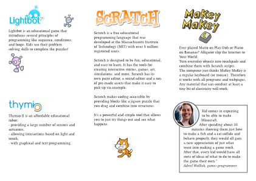

[Download the draft Pdf](flyer-kids.pdf)

|          |         |          |
| internal | back    | front    |
|          | cover   | cover    |
|          |         |          |
|          |         |          |
|          |         |          |

|          |         |          |
| content  | content | content  |
|    1     |    2    |    3     |
|          |         |          |
|          |         |          |
|          |         |          |

## front

	For Ninjas aged 7 to 17

	On Sundays 15:00 – 17:00 

    There is only one rule, Be cool!

## back

	CoderDojo is a volunteer led network of free computer programming
	clubs for young people aged 7-17.

	CoderDojo puts an emphasis on self-motivated learning through
	project work, peer-to-peer mentoring and the creation of
	innovative projects.

	There are over 450 CoderDojos teaching young people how to code in
	over 45 countries around the world.

	Sunday, 15:00 - 17:00 @ Liip

	Limmatstrasse 183 8048 Zürich http://coderdojozh.github.io/

## internal

### The Zurich CoderDojo

	The Zurich CoderDojo is a multilingual group (DE, EN, IT, PL, FR).
	You will learn much more out of this seesions if you can attend
	regularly. Of course it does not have to be every week.  Bring
	your own laptop. If needed, we can also provide computers on
	demand.  No constant supervision by parents is necessary. Parents
	can relax in our small lounge.

### Activities

	Ninjas who have never coded before are introduced to Lightbot and
	learn the basics about programming.  Our main platform is Scratch,
	a powerfull jigsaw-like programming environment.  Furthermore we
	run Makey Makey, Thymio and other interesting workshops.

###Get in touch

	You can get in touch with the Zurich CoderDojo and follow our news
	through our Twitter channel: @CoderDojoZH

	If you want to join our weekly dojo with your kids , please
	register on our Meetup page:
	http://www.meetup.com/Coder-Dojo-Zurich

	And you can of course visit our website:
	http://coderdojozh.github.io/

## content 1

### Lightbot

	Lightbot is an educational game that introduces several principles
	of programming like sequence, conditions, and loops. Kids use
	their problem solving skills to complete the puzzles!

### Thymio

	Thymio II is an affordable educational robot:

	- providing a large number of sensors and actuators, allowing
	- interactions based on light and touch, with graphical and text
	- programming.

## content 2

### Scratch

	Scratch is a free educational programming language that was
	developed at the Massachusetts Institute of Technology (MIT) with
	over 5 million registered users.

	Scratch is designed to be fun, educational, and easy to learn. It
	has the tools for creating interactive stories, games, art,
	simulations, and more. Scratch has its own paint editor, a sound
	editor and a ton of pre-made assets that make it easy to pick up
	via example.

	Scratch makes coding accessible by providing blocks like a jigsaw
	puzzle that you drag and combine into structures.

	It’s a powerful and simple tool that allows you to just try things
	out and see what happens.

## content 3

### MaKey MaKey

	Ever played Mario on Play-Doh or Piano on Bananas? Alligator clip
	the Internet to Your World.

	Turn everyday objects into touchpads and combine them with Scratch
	scripts.

	The computer just thinks MaKey MaKey is a regular keyboard (or
	mouse). Therefore it works with all programs and webpages.

	Any material that can conduct at least a tiny bit of electricity
	will work.

### Testimonial

	Kid comes in expecting to be able to make Minecraft.  After
	spending about 30 minutes showing them just how to make a fish and
	a cat collide and behave properly, they would all gain a new
	appreciation of just what went into making a game work.  After
	that, every kid would have all sorts of ideas of what to do to
	make the game their own.”  Adriel Wallick, games programmer.
