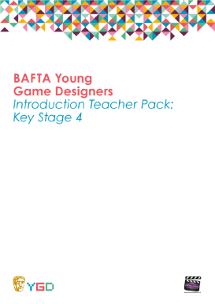
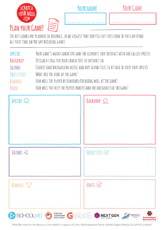
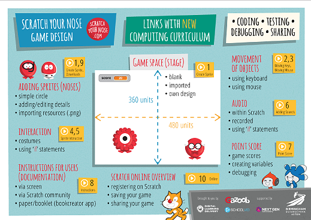

# External resources

This directory contains resources found around in the wide internet and that can help us improve our dojo.

Some of them are links to websites, other are PDFs that have been cached "locally".

## Scratch your nose 2015

http://www.scratchyournose.com/#!print-resources/c142m

The number link to the video tutorials on <http://www.scratchyournose.com/#!video-tutorials/cccq>

1. Creating a sprite

   - Go to costumes
   - Draw with circles, lines and rectangles
   - Set fill and line color
   - Clone and move items
   - Choose a backdrop
   - Add the `xy-grid` backgrop from the library

2. Moving using keys

  - show motion
  - show `the on key pressed` control element
  - right: `on right key + move 10
  - left: `on left key + move -10`
  - left: `point in direction 0 > move 10 ; right: point in direction 90 > move 10; up: point in direction 0 > move 10; down point in direction 180 > move 10`

3. Moving using the mouse

  - `When green flag + got to mouse pointer`
  - Follow: `When green flag + forever + got to mouse pointer`
  - Add a delay: `When green flag + forever (wait 1 second + got to mouse pointer)`
  - Point to mouse: `When green flag + forever (wait 1 second + point towards mouse pointer + got to mouse pointer)`

4. Sprite interaction

  - Starting point: Tutorial 2
  - Add the `xy-grid` backdrop
  - Add the shark (or any scary sprite)
  - Get the shark to move around forever: `forever + move 10 steps`
  - Slow down by putting a `wait of 0.1 seconds` after each move
  - `If on edge bounce`
  - `If on edge bounce + set rotation style left-right`
  - `set rotation 15°` before starting the forever loop
  - Add `switch costume` after each move to improve the animation

5. Sprite interaction (2)

  - Starting point: Tutorial 4
  - use `next costume` instead of switching to specific costume
  - move around your sprite to avoid the shark
  - remove the `next costume`
  - at the bottom of the shark's forever loop add a `if touching sprite 1(switch to costume with open mouth)`

6. Adding sounds

  - Starting point: Tutorial 2
  - Go to sprite's sound tab, choose a sound, play it
  - `If touching edge (play sound)`
  - duplicate it three time and add it to each `when key pressed` control

7. Point scoring

  - Starting point: Tutorial 2
  - add a wizard hat sprite
  - create `points` variable and place its visualisation in the top left corner
  - on the same green flag event add a `forever loop + (if touching hat + change points by 1)
  - to avoid huge points count add a `glide to 0, 0` at the end of the loop

8. Instructions

  - Starting point: Tutorial 3
  - Write the instruction on the backgrop: "Use mouse to guide the nose.\n Click on green to start"
  - Add a fancy backdrop
  - On the backdrop add "on green flag > switch backdrop"

8. Downloads

 - Downloading the nose pack

10. Online

 - How to create an account
 - How to login
 - My stuff
 - Explore

11. Adding costumes

 - Download images from Nose pack (or any other website that has PNGs on it)
 - Open the file from Scratch
 - Loading costumes from further PNGs
 - (with a bit of luck, SVGs are also valid costumes and are easier to tweak)

12. Animating costumes

 - Choose a sprite with multiple costumes
 - `When flag clicked + next costume + wait 0.5 sec + next ... `
 - `When flag clicked + forever (next costume + wait 0.5 sec + next ... )`
 - `When loudness + next costume`, put a sound on click on another sprite and click on that sprite

13. Adding game timers

 - Make a `timer" variable for the current sprite only
 - Rename the sprite
 - `When flag clicked + set timer to 60 + wait 1 secs + change timer by 1`
 - `When flag clicked + repeat 60 (set timer to 60 + wait 1 secs + change timer by 1)` fails
 - `When flag clicked + set timer to 60 +  repeat 60 (wait 1 secs + change timer by 1)`
 - clone the sprite: each one has its own timer

14. Cloning a sprite

 - download the robot from the dancethon "scratch your nose" pack (or use any other dancing sprite)
 - `when this sprite clicked + create clone of [sprite name]`
 - `when this sprite clicked + create clone of [sprite name]` + `when i start as a clone + move 100 steps + change ghost effect by 50`; move around the original with mouse and create ghost clones
 - `when this sprite clicked + create clone of [sprite name]` + `when i start as a clone + repeat 2 times (wait 1 secs +move 100 steps + change ghost effect by 50)`
 - `when this sprite clicked + create clone of [sprite name]` + `when i start as a clone + repeat 2 times (wait 1 secs +move 100 steps + change ghost effect by 50) + delete clone`

15. Following a line

 - `when space key pressed + set size to 50% + glide 1 secs to -200,-100` (set the size to something meaningful)
 - `when this sprite clicked + forever (move 10 steps + wait 0.2 secs + next costume)`
 - add a sprite with a diagonal line in the right lower corner, move the original sprite with the mouse and show it following it. 
 - at the end of the loop of the `when this sprite clicked` event add `if touching sprite [line] then + change y by 10 + change size by -3`
 - add a background with a path that matches the line by form and color (like the purple chastle hall): the sprite follows the carpet and shrinks while getting more far away.

16. Good resources
 - the scratch your nose web page
 - the scratch wiki
 - projects.codeclubworld.org
 - <amazingict.co.uk/computing>
   -  QuickStart Computing for [primary](http://primary.quickstartcomputing.org/) and [secondary](http://www.quickstartcomputing.org/secondary/index.html) teachers (under Open Government Licence c3.0, a by-if-you can license)

Further notes:

- embedding a scratch program in your webpage
      <iframe allowtransparency="true" width="300" height="210" src="http://scratch.mit.edu/projects/embed/52247988/?autostart=false" frameborder="0" allowfullscreen=""></iframe>
